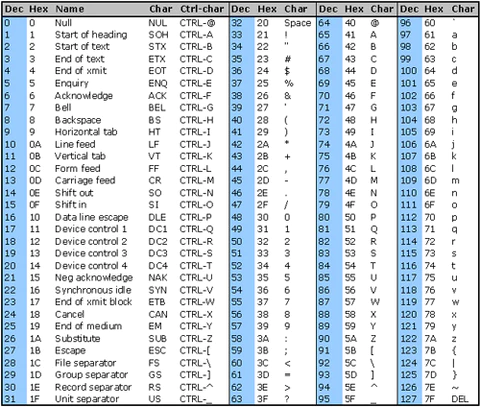
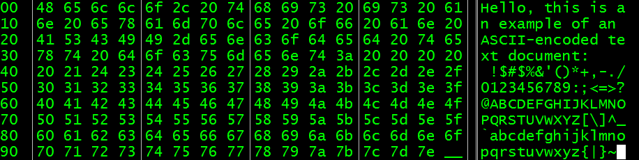
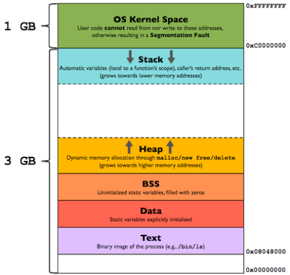

# Элементы компьютерных наук

## Введние

Книга - продолжение [предыдущей](https://github.com/voodam/pages/tree/master/qa_book/), опирается на материал из нее. В книге раскрыты темы, полезные для глубокого понимания компьютерных наук и IT сферы. Скорее ориентирована на программистов, QA Сеньоров или SDET. Как и в предыдущей, постарался рассказать простым языком самые важные идеи.


## Биты и байты

Вопрос, который может интересовать новичков: каким образом все сущности в компьютере (текст, графические изображения, фильмы, сами программы) кодируются двоичными числами? Это не сложно представить: двоичные числа - это натуральные числа (система счисления не важна для текущего объяснения): 0, 1, 2, 3, ..., их бесконечное количество. Кодирование - это просто сопоставление одной сущности другой, например, буквы алфавита числу. Также обстоит дело и с графикой (где кодируются пиксели), программами (команды процессора и данные) и так далее. Посмотрите на пример: здесь показана таблица символов текста (ASCII), а следом, как выглядит текст в ASCII формате в бинарном виде (учтите, что бинарный код показан 16-ричными числами, то есть в таблице нужна колонка Hex, а не Dec).




Очевидно, что существует бесконечно много способов закодировать одну и ту же информацию. Эти способы называются кодировками. Разнообразие реально применяемых кодировок обсуловлено:

* Историческим контекстом (когда-то ошиблись в предположениях, сейчас сделали бы по-другому, но кодировка распространена и от нее так просто не уйти).
* Плюсами и минусами той или иной кодировки (хороша для определенных задач).
* Прочими причинами: конкуренцией компаний и так далее.

Понятие, тесно связанное с кодированием - сжатие. Сжатием называется такое кодирование, при котором достигается наименьший размер в байтах. Некоторые примеры сжатия:

* Сопоставлять наиболее часто повторяющиеся значения с более короткими числами.
* Выделять общие части значений и кодировать их отдельно (префиксный код). Например, если большинство слов в тексте начинается с букв "пре-" ("прекрасный", "предлог" и так далее), то можно последовательность "пре" закодировать отдельно коротким числом (префикс). Другой пример: телефонные номера, где код страны и код города - это префиксы.

Это только примеры, а реальные методы кодирования и сжатия обычно более сложные и изощренные. Помимо сжатия, кодирование может иметь и другие цели, например, защищать от ошибок при передаче по сети.


## Архитектура компьютера

Компьютер состоит из: процессора (CPU), оперативной памяти (RAM), накопителя (HDD/SSD) и других внешний накопителей (CD, Flash), а также различных дополнительных устройств ввода-вывода (сетевая карта, клавиатура, монитор, MIDI-контроллер и так далее). Также существует понятие сопроцессора: если процессор - вычислительное устройство общего назначения, то сопроцессоры нужны для конкретных задач. Раньше существовали различные виды сопроцессоров, например, для вычисления чисел с плавающей точкой (FPU), но сейчас их редко можно встретить. К сопроцессорам можно отнести и видеокарты (GPU).

Упрощенно можно представить взаимодейстие элементов компьютера таким образом:

* Процессор беспрерывно выполняет те или иные команды, заложенные в программах или операционной системе (либо простаивает). Каждая команда процессора, как правило, довольно проста: сложить два числа, записать данные из памяти или в память и так далее. Из этих команд складываются более сложные действия, подобно тому, как числами можно закодировать любую информацию.
* Устройства сообщают о себе ту или иную информацию, используя аппаратные прерывания (приостанавливают выполнение процессором текущего набора команд и переключают его на обработку возникшей ситуации) или выставляя данные на шину данных, по которой они подключены к компьютеру. Во втором случае процессор сам опрашивает шину данных (конечно, не сам, а исполняя какую-либо написанную программу), и принимает некоторые действия.

Различные виды памяти обладают разными характеристиками:

* Оперативная память быстрая, но дорогая, и при этом не сохраняет данные после выключения ПК (персистентно).
* Накопители более дешевы и позволяют хранить данные персистентно, но более медленные.
* Регистры процессора - небольшие банки памяти, обладающие максимальным быстродействием, но очень маленьким размером. Процессор обычно сперва копирует данные из памяти в регистры, а затем работает с ними [(см. ниже)](#процессор).
* Кэш процессора - нечто среднее между регистрами и оперативной памятью, используется для увеличения быстродействия. Кэши бывают нескольких уровней (L1, L2, L3), также образуя иерархию по объему/быстродействию.

Важным понятием является иерархия памяти. Так как разные типы памяти обладают разным временем доступа к ним (latency), то программисты могут увеличить скорость программ, минимизируя обращение к медленной памяти. Интересно то, что современные сетевые устройства порой обгоняют по скорости накопители, делая более привлекательными распределенные системы (работающие между несколькими компьютерами).


Кеширование (или мемоизация) - техника программирования, которая заключается в том, чтобы сохранять данные в памяти после вычисления, и затем обращаться к ним повторно (например, перед вычислением факториала числа можно проверить, не был ли он вычислен до этого, и если да, вернуть готовый результат). Таким образом можно избежать как обращения к более медленной памяти, так и повторных вычислений процессора.

Это лишь самое упрощенное представление, в действительности существуют больше деталей:

* Твердотельные накопители читают данные блоками, а не побайтово, как RAM.
* Для HDD во время доступа входит время позиционирования головки (примерно как в виниловом или CD проигрывателе), поэтому для ускорения стараются хранить данные рядом и читать большими порциями.
* Хоть RAM (random access memory) предполагает, что скорость доступа к данным не зависит от их физического положения (как в случае HDD), это не всегда верно, так как архитектура мультипроцессорных систем предполагает, что определенные слоты памяти ближе к определенному процессору ([NUMA](https://ru.wikipedia.org/wiki/Non-Uniform_Memory_Access)).
* Для процессора доступ к блоку данных RAM (из-за устройства CPU кешей) быстрее, чем к случайно расположенным данным (в том числе поэтому работа с массивами быстрее, чем со списками [(см. ниже)](пTODO).
* В CPU существует [предсказание ветвлений](https://ru.wikipedia.org/wiki/%D0%9F%D1%80%D0%B5%D0%B4%D1%81%D0%BA%D0%B0%D0%B7%D0%B0%D1%82%D0%B5%D0%BB%D1%8C_%D0%BF%D0%B5%D1%80%D0%B5%D1%85%D0%BE%D0%B4%D0%BE%D0%B2), которое может влиять на скорость выполнения кода.

И так далее. Главный вывод в том, что программирование очень часто про ньюансы и тонкости, которые бывают довольно сложны, и про необходимость найти среди них оптимальное решение. Но базовая модель, позволяющая представить архитектуру ПК, при этом, не очень сложная.

### Процессор

Изначально процессор напоминал сложный калькулятор, который производил вычисления с числами, а также читал их из памяти и записывал обратно. То есть в нем не было отражено никакой информации о высокоуровневых конструкциях, а в основном только о работе с битами и байтами. Затем процессоры немного отошли от этой модели, реагируя на потребности высокого уровня. Появились инструкции, которые позволяют работать с памятью в защищенном режиме, так как это то, что обычно необходимо во всех операционных системах. Или инструкции для быстрой работы с текстом, так как необходимо парсить большие объемы данных текстовых форматов (HTML, JSON, XML). Но в целом концепция осталась прежней: все мало-мальски высокоуровневые задачи решаются на уровне программного кода, языков программирования или операционной системы.

Исполняемый, или бинарный код - это как раз те инструкции, с которыми работает процессор. В нем нет даже конструкций `if`, `else`, `while`, не говоря о более сложных. Зато есть джампы (jumps, `goto` в языке Си) - инструкции для "перепрыгивания" текущей инструкции в новое место (процессор, в основном, выполняет инструкции последовательно). Исполняемый код загружается в оперативную память и считывается процессором, как и обычные данные, а затем декодирует их. Условно представим, что число 1 - это команда `ADD` процессора, 2 - `LOAD`, 3 - `SAVE`. Тогда бинарная последовательность команд `251 226 1 12 317` может означать: загрузить из ячейки памяти под номером `5` данные в регистр `1`, затем из `6` в регистр `2`, затем сложить эти два числа (результат будет записан в регистр `1`) и сохранить результат в ячейку памяти `7`. На деле ньюансов гораздо больше, но такое представление достаточно адекватно для понимания.

Кеш процессора почти не контроллируется программистом: нет инструкций для чтения/записи в него, а только для чтения/записи в память, а CPU сам решает, как кешировать данные. Бывает полезно понимание тонкостей работы кеша CPU, чтобы писать более производительный код.

Зачастую устройства работают через механизм виртуальной памяти [(см. ниже)](#виртуальная-память): процессор читает и записывает данные в определенные участки RAM, на работу с которыми настроено устройство, не обращаясь к нему напрямую. Тогда для CPU работа с устройствами не отличается от работы с памятью, что удобно.


## Операционная система

ОС выполняет ряд задач:

* Защищает среду выполнения от некорректных или вредоносных программ. Иначе любая плохо написанная программа прекращала бы работу всей системы (вспомните Windows BSOD). На уровне ОС также существуют права доступа к файлом и другим ресурсам.

* Управляет программами и ресурсами компьютера оптимальным образом. Для простоты представим однопроцессорный компьютер. Одновременно работает множество программ (помимо самой операционной системы), но необходимо, чтобы пользователь не замечал простоя. Некоторые программы ожидают данных по сети или с диска, и не могут выполнить полезную работу - на это время необходимо дать работу другим. К тому же программы запрашивают доступ к файлам, сетевым сокетам и другим ресурсам. Необходимо организовать их работу, обеспечив в том числе и максимальное быстродействие. Также у ОС может быть множество пользователей, работающих с ней одновременно - необходимо обеспечить удобную работу и им.

В случае многопроцессного компьютера, менеждер процессов работает сходным образом, но теперь некоторое число программ (равное числу ядер у процессора) действительно выполняется одновременно. Если же у CPU одно ядро, то в один момент времени всегда выполняется одна программа, но из-за быстрого их переключения пользователь этого не замечает.

* Создает удобный API для доступа программиста к ресурсам компьютера, самой ОС, и устройствам. Драйверы - специальное ПО-прослойка между ОС и устройством (в отличие от обычных программ выполняется привелегированно, то есть ошибка в драйвере вызовет сбой всей системы). Прикладной программист же взаимодействует с API ОС, не думая, какая перед ним модель сетевой карты и так далее.

В узком смысле, операционная система - это именно ядро, обеспечивающее перечисленные функции. Весь системный софт, не ответственный за это (например, компиляторы, текстовые редакторы и так далее), строго говоря, не является частью ОС. Но в бытовом смысле под ОС понимают и его тоже, трактуя этот термин более широко.

API операционной системы называется набором системных вызовов. Каждый из них обернут в функции, которые со стороны не отличить от других функций стандартной библиотеки. Вот несколько самых популярных на примере Python:

* Работа с файлами и вводом-выводом: `open`, `print`.
* Работа с сетью: `socket`.
* Работа с потоками, в том числе `sleep`.

С другой стороны, например, работа со строками или списками не требует системных вызовов и реализованы исключительно средствами самого языка.

Поскольку системные вызовы обращаются к ресурсам ОС, то отличаются от обычных функций тем, что часть их кода должна выполниться на стороне ОС. Режим обычной программы называется режимом пользователя, в которой не разрешен ряд действий, а обращение к памяти ограничено памятью самой программы (то есть она не может, например, прочитать данные другой программы и украсть их). Режим, в котором работает ОС, называется режимом ядра. При выполнении системного вызова происходит следующее:

1. Программа просит ОС выполнить какой-то вызов.
2. ОС перехватывает управление процессором и выполняет этот вызов в режиме ядра, результат записывает в память программы.
3. Управление возвращается программе, она читает результат работы системного вызова и продолжает работу.

Эти действия называются переключением контекста. Также переключение происходит, когда нужно приостановить одну программу и отдать управление процессором другой.

### Процессы и потоки

Процессом называется программа, загруженная в RAM и выполняемая в текущий момент. Операционная система выделяет ей определенное количество памяти и ресурсов, которые могут дополнительно запрашиваться и освобождаться во время работы программы (файлы, stdin, stdout, сокеты и так далее). Упрощенно, память процесса состоит из нескольких сегментов:

* Text. здесь расположен бинарный код, загруженный с накопителя. По нему движется процессор, выполняя инструкции.
* Heap (куча). Здесь располагаются данные, создаваемые во время работы программы.
* Stack (стек вызовов). Здесь находятся аргументы, возвращаемые значения и локальные аргументы функции.
* BSS и Data - не принципиальны, пропустим их.



Мы видим, что размер кучи и стека может увеличиваться. Если программа превысит отведенный ей размер в памяти, она упадет с ошибкой.

Что касается выделения памяти под переменные, здесь ситуация несколько сложнее, чем описано выше. Такие языки, как C/C++, позволяют явно указывать, где будет расположена переменная - на стеке или в куче. Каждый подход имеет свои плюсы, в которые мы не будем вдаваться. Языки с автоматической сборкой мусора (garbage collection) могут сами решать, где хранить те или иные переменные. Обычно небольшие объекты (числа и так далее) храняться на стеке, а большие объекты, включающие другие объекты, в куче.

Если процесс - это загруженная в память программа + набор ее ресурсов, то поток - это последовательность команд, которые процесс выполняет друг за другом. Каждый процесс имеет один или несколько потоков, и каждый поток принадлежит к какому-то одному процессу. Стек вызовов ассоциируется именно с потоком, а не процессом, так как в нем находятся данные выполняемых в текущий момент функций. В каждый момент времени регистр команд процессора указывает на какую-то команду из Text, эта команда находится в какой-то функции `F`, а стек вызовов содержит функцию `F`, затем ту, которая вызвала `F` (функция `G`) и так далее вплоть до точки входа (функции `main` или другой). При переключении контекста ОС приостанавливает и запускает именно поток.

Так как потоков на процесс может быть несколько, это значит, что одна программа может выполняться в несколько потоков. Они будут иметь общие ресурсы, память, но при этом выполняться одновременно (ОС будет переключать их выполнение, как и выполнение двух разных программ). Область программирования, изучающая работу с потоками, называется [параллельное](TODO) (или конкуррентное) программирование. Многопоточность позволяет повысить производительность или организовать архитектуру приложения некоторым образом.

### Виртуальная память

Виртуальная память - интересная абстракция ОС, позволяющая убить одним выстрелом несколько зайцев. Суть в следующем: вместо физического адреса в памяти процессор обращается к виртуальному, который преобразуется в физический. Эта технология поддерживается на уровне процессора. Вот возможности, которые она предоставляет:

* Ограничить доступ к памяти других программ. От процесса скрыта информация, где находится память других процессов, а если он обратится за отведенные ему пределы памяти, то программа будет завершена операционной системой.

* Возможность использовать больше RAM, чем доступно, используя файл подкачки (swap в Linux, `pagefile.sys` в Windows). Редкоиспользуемая память выгружается на диск. При обращении к выгруженной памяти ОС получает прерывание и незаметно для программы загружает нужную область из файла подкачки.

* Программы могут организовывать совместный доступ к памяти, если определенным областям памяти установить разрешения для нескольких процессов. Эта возможность называется разделяемой памятью (shared memory). При таком подходе возможно обращение к данным, общим между несколькими процессами (по аналогии с общими данными между потоками). Это самый высокопроизводительный способ межпроцессного взаимодействия, но более сложный в использовании, чем, например, сокеты.

* Можно отобразить файл в память (системный вызов `mmap`) и работать с ним не файловым API (`open`, `seek` и так далее), а как с обычным массивом памяти, что более производительно во многих случаях. При этом данные в конечном итоге сохранятся в файл.


## Функциональное программирование

Идея функционального программирования довольно проста - все функции должны быть чистыми (pure functions), то есть не иметь никакого воздействия на внешний мир. В терминах ФП функция - это чистая функция, а процедура - функция с побочными эффектами (далее до конца главы слово "функция" будет применяться в этом смысле). Чистые функции должны:

* Не изменять никаких переменных (в том числе глобальных).
* Не создавать побочных эффектов: писать в базу данных, отправлять данные по сети, выводить текст на экран и так далее.

Таким образом, нигде не используются операторы присваивания. (Если быть точнее, используются не более одного раза, присвоить переменной новое значение нельзя. Это присвоение называется привязкой.)

Возникают два вопроса: как этого достичь и зачем это надо. Что касается первого вопроса: верно утверждение, что любой императивный алгоритм можно переписать в функциональном стиле.

* Циклы заменяются на комбинаторы коллекций (`fold`, `reduce`, `map` и другие) либо рекурсивный вызов функции.
* Изменяемые структуры данные заменяются на неизменяемые. Существуют [наработки](https://dmkpress.com/catalog/computer/programming/functional/978-5-97060-233-1/), позволяющие делать их довольно эффективными. Стандартная библиотека функциональных языков обычно имеет их в своем составе.
* Изменение значений заменяется на их возврат из функции.
* Обычные классы и структуры данных заменяются на неизменяемые: вместо установки значения возвращается новый объект:

```
class User:
  def __init__(self, name, surname):
    self.name = name
    self.surname = surname

  def with_name(new_name):
    return User(new_name, self.surname)

  def with_surname(new_surname):
    return User(self.name, new_surname)

u1 = User("Иван", "Петров")
u2 = u1.with_name("Петр").with_surname("Иванов")
print(f"{u2.name} {u2.surname}") # Петр Иванов
```

* Для достижения побочных эффектов используются монады (см. ниже).

Плюсы ФП:

* Воспринимать и рассуждать о функции, результат которой детерменирован только параметрами, намного проще, чем пытаться понять, какими путями менялись данные в коде. Код таким образом становится похож на математические формулы, уменьшается привнесенная сложность. Также это уменьшает количество багов.

Лирическое отступление: говорят, что такой код становится более декларативным и менее императивным, ведь мы не описывали, КАК будет будет выполняться код, а описывали, ЧТО нужно получить. На мой взгляд, в этих терминах есть доля лукавства, и лучше просто рассматривать это, как другой стиль программирования.

* Простота чистых функций вкупе с SRP приводит к высокой композируемости кода. Такие функции называются комбинаторами.

* Высокий уровень абстракций, взятый из высшей математики (теории категорий) позволяет иногда достичь такой гибкости, которой не достигают другие подходы. Яркий пример - монады, о которых ниже.

* Хорошо сочетается с параллельными и распределенными вычислениями. Так как данные не изменяются, их невозможно повредить при одновременном чтении из разных потоков (эту особенность используют [Futures](#futures)). И так как результат работы зависит только от входных значений, функции можно распараллелить на несколько потоков, процессов или компьютеров (это используется в подходе MapReduce).

* Это просто интересно и освежает восприятие, позволяя посмотреть на решение задач программирования под другим углом.

Минусы ФП:

* Требует изменения мышления. Поначалу может быть довольно непривычно писать алгоритмы в функциональном стиле (как когда-то было сложно начинать в императивном).

* Алгебраические абстракции могут быть довольно сложны для восприятия.

* Накладные расходы на копирование данных. Хотя многие структуры данных оптимизированы под быструю работу, все-таки они медленее императивных аналогов. Собственные структуры данных и классы тоже постоянно копируются, что сказывается на производительности и потреблении памяти.

* Не всегда игра стоит свеч. Все-таки, порой ФП не упрощает, а усложняет код, а для нас простота - один из главных приоритетов.

* Порой, ФП ведет к созданию побочных проблем, не связанных с сутью задачи. Например, чтобы готовые библиотеки, написанные в императивном стиле, органично вписались в функциональный проект, придется написать множество оберток к ним.

Вообще, мы не обязаны применять строгий подход ради достижения преимуществ. Иммутабельность только части функций и структур данных даст пропорционально полезный результат. Правда, чистые функции, в которых используются обычные процедуры, также перестают быть чистыми и становятся процедурами - за этим нужно следить. К тому же, если иммутабельность критически важна для этого подхода, то наличием побочных эффектов можно пренебречь, и таким образом сэкономить на сложных абстракциях, вроде монад.

Теория категорий не обязательна для функционального программирования, но ее концепции гармонично сочетаются с ним. На практике применяются два подхода к ФП:

* Хардкорный (Haskell, Scala) - полностью чистые функции, использование теории категорий.
* Практичный (Clojure) - иммутабельные структуры данных, но без ТК и с побочными эффектами, которые изолируются собственной дисциплиной, а не при помощи монад.

Некоторые элементы функционального программирования проникают в мейнстримные языки (лямбды, иммутабельность, списковые выражения, `map`, `reduce` и так далее), так что вам будет полезно знать его, даже не работая в чистой функциональной парадигме.

### Монады

Одна из самый интересных концепций теории категорий. Монады позволяют отделить вычисления от какого-либо контекста. На практике это означает примерно следующее: предоставляют SRP там, где не хватает для этого других средств языка программирования. Представьте, что вы пишете какой-то код, и некоторые переменные могут быть не определены:

```
if user and user.full_name and user.full_name.name:
  msg = f"Dear {user.full_name.name}, ..."
else:
  msg = None
```

Довольно неудобно каждый раз писать проверку существования переменной. Но вот, что можно сделать вместо этого (синтаксис Scala):

```
const msg = 
  for full_name <- user.full_name
      name <- full_name.name
    yield s"Dear $name, ..."
```

Работая c кодом внутри `for`, мы находимся в контексте монады: достаточно написать `<-`, и получим значение, с которым можем работать дальше по цепочке.
Типы переменных `msg`, `user.full_name` и `user.full_name.name` - не `String`, а `Option[String]` - монада Option, параметризированная типом String. Все это нужно, чтобы вынести "за скобки" некоторые однообразные действия, в данном случае проверку существования переменной. Если на каком-либо шаге переменная (`full_name`, `name`) будет пустой, то результирущее значение `msg` также будет пустым.

Другой пример - работа с ошибками. В прошлой книге мы рассматривали исключения, которые позволяют не передавать и проверять вручную коды ошибок после каждого вызова функции. Но можно использовать для этого и монаду (далее псевдокод):

```
const result =
  for file <- open_file(file_name)
      lines <- get_lines(file)
      new_lines = modify_lines(lines)
    yield save_file(new_lines)
```

Каждая из функций возвращает не просто значение, а монаду `Either`, в которой лежит значение в случае успешной работы, либо код ошибки. Если какая-либо из функций вернет ошибку, то дальнейшие не выполнятся, а в `result` будет эта ошибка - так же ведут себя исключения, прерывая весь последующий код. Если нужно обработать ошибку, а не передать ее дальше, для этого существует богатый набор комбинаторов. Таким образом, мы получили функциональность, не уступающую исключениям, но средствами библиотеки, а не языка программирования, а также с четкой типизацией: в случае исключения мы обычно не видим его тип в сигнатуре функции (хотя Java позволяет это сделать, но это менее удобно), а `Either` включает тип ошибки.

Другая интересная монада - `Future`, позволяет производить отложенные вычисления (получение данных по сети, многопоточные вычисления и так далее).

Также монады позволяют превращать процедуры в чистые функции. Допустим, нужно сохранить данные в файл, отправить их по сети и так далее. Мы можем описать эту последовательность действий каким-то набором комбинаторов. Никакие действия еще не произведены, а только описаны и сохранены в монаде. Далее мы запускаем специальную функцию (обычно, `run`) и все действия выполняются. Но, при этом, все функции, их описывающие, являются чистыми. Такое ухищрение может помочь, например, при тестировании: так как `run` не запущен, то файлы и сеть нетронуты, но мы можем проверить, что последовательность действий верная. Таким образом, весь код состоит из чистых функций, и только в одном месте вызывается `run`, а также большая часть кода находится в контексте монады (обычно `IO`). То есть, если императивный код описать в монаде, то он становится функциональным при использовании отложенных вычислений. Стоит ли игра свеч, сказать сложно.

Программировать с монадами имеет смысл только в языках, где поддерживается удобный синтаксис для них (`for` в Scala, `bind` в Haskell). Без этого технически использовать их возможно, но это создаст столько синтакического шума, что сведет плюсы на нет. Дело в том, что без удобного синтаксиса монады работают через передачу лямбд. Сравните с кодом выше (Python):

```
result = open_file.flat_map(lambda file: get_lines(file))
                  .map(lambda lines: modify_lines(lines))
                  .flat_map(lambda new_lines: save_file(new_lines))
```

Многие популярные языки программирования идут путем добавления языковых конструкций под каждую задачу, хотя монады, как мы видим, дают большую гибкость для разработчика. Ниже таблица соответствия монад в Scala и синтаксических конструкций в Javascript (в других языках ситуация сходная):

| Scala  | Javascript        |
| ------ | ----------------- |
| Option | Optional chaining |
| Future | async / await     |
| Either | Исключения        |

Напоследок стоит сказать, что монады проще понять, работая с ними, чем читая про них - слишком это абстрактные идеи (как и вся теория категорий). Однако на практике это оказывается несложно.


## Современное ООП

В предыдущей книге мы говорили о том, что в современных языках вроде Java и C# чистое ООП переосмыслено и подход изменен в сторону смешанного с процедурным. Тем не менее, он отличается от того, что можно встретить в Python, Javascript и подобных языках. Иногда это различие обусловлено техническими ограничениями (в Java и C# нельзя создать функцию вне класса), иногда сложившимися подходами (в PHP используется Java like подход, хотя есть и отдельные функции). В этой главе мы рассмотрим основные отличия - это будет полезно, чтобы не запутаться в стилях программирования и применять каждую технику осознанно. Очень часто разработчики, пришедшие, например, из мира Java в Python, также тащат туда старые подходы, не осознавая их плюсов и минусов.

Первое, что стоит понять об этом подходе - в нем очень озабочены гибкостью. Например, если вы использовали функцию в другой функции, то не сможете без ухищрений переопределить ее при необходимости - это нужно дополнительно программировать. С другой стороны, если вы передали объект, который содержит метод, то чтобы переопределить его, нужно просто передать другой объект с тем же интерфейсом. Часто ли нужна такая гибкость? Практика показывает, что не очень. При этом мы жертвуем сложностью кода: классы вместо функций - все-таки некоторое усложнение, так как объект нужно еще передать в другой объект. Статические методы (полные аналоги функций в процедурном подходе) при этом используются редко, так как не дают гибкости и часто имеют громоздкий синтаксис (нужно предварять их вызов именем класса).

### Dependecy Injection

Для удобной передачи объектов в другие объекты придуман специальный подход - Dependency Injection (DI), смысл которого довольно прост. Допустим, у нас есть класс, который для своей работы требует двух других вспомогательных классов. В Python мы бы просто использовали функции, импортируя их из разных модулей. Но с классами ситуация другая: нужно не только вызвать их методы, но и создавать (инстанцировать) объекты. Если сделать это в конструкторе, то мы потеряем возможность гибкой замены классов, поэтому будем передавать их в аргументы конструктора.

Хорошо, но тогда получается, что объекты нужно инстанцировать где-то "снаружи" классов. При этом некоторые объекты нужны в единственном экземпляре (большинство из них), а некоторые в нескольких. Получается иерархия включения одних объектов в другие. Можно просто инстанцировать их где-то в одном месте, но это много однообразного кода, поэтому обычно используют специальные библиотеки. Они сильно упрощают эту задачу, работая примерно по такому алгоритму:

1. Если в аргументе конструктора типом указан класс, то будет инстанцирован и передан этот класс. На все классы, требующие его, по умолчанию будет создан один экземпляр, но это можно переопределить в конфигурации.
2. Если в аргументе конструктора типом указан интерфейс, и его имплементирует единственный в проекте класс, то будет автоматически инстанцирован этот класс.
3. Если имплементаций интерфейса несколько, то необходимо указать нужный класс в каждом конкретном случае, либо задать по умолчанию.
4. Различные отклонения от поведения по умолчанию также задаются в конфигурациию.

Не все классы загружаются через DI, так как некоторые из них должны создаваться по ходу работы алгоритма, а не существовать с момента старта программы. Первый вид классов обычно называется сервисами, а второй - моделями.

Таким образом, мы получаем двойственную ситуацию: с одной стороны имеются обычные модули, подключаемые командой `import` или подобными, а с другой есть DI, где сервисы - тоже своего рода модули, но с возможностью полиморфизма и наследования.

Чтобы не запутаться, приведем таблицу соотвествий элементов ОО и процедурной парадигм:

| Процедурное прог-е | Современное ООП                                  |
| ------------------ | ------------------------------------------------ |
| Функция            | Метод класса (редко статический)                 |
| Модуль             | Также модуль, либо сервис, подключенный через DI |
| Структура данных   | Модель                                           |

Когда у вас есть выбор, какому подходу отдать предпочтение, советую отталкиваться от реальных потребностей. На мой взгляд, редкая потребность в гибкости не стоит усложнения всего кода, независимо от того, получит ли он преимущества от этого.

### Геттеры и сеттеры

Идея простая: чтобы защитить данные от прямого изменения, стоит не обращаться к ним напрямую, а использовать для этого методы (обычно называются по типу `get_something` и `set_something`, но необязательно). Тогда в случае изменения внутренних данных класса вам не понадобится искать и исправлять в коде  все обращения к нему. Проблема примерно та же, что и с Dependency Injection - далеко не всегда это необходимо, но при тщательном следовании ваш проект будет состоять процентов на 30 из бойлерплейт-кода.

Есть бескровное решение этой проблемы: во многих языках (Scala, Python, JS) есть специальные конструкции (properties, неизменяемые переменные и так далее), которые делают невидимым разницу между обращением к переменной и методу. Таким образом, если вы решите вместо переменной использовать геттер или сеттер, вы можете изменить только сам класс и не сломать контракт с кодом, использующим его.

### ФП в мире ООП

Элементы функционального программирования успешно проникли практически в любой современный язык. Удобство лямбд и преимущества неизменяемых объектов известны большинству программистов. Ниже рассмотрим некоторые соответствия из разных парадигм.

* Неизменяемых объект эквивалентен замыканию.

```
def f(get_full_name):
  ...

name = "Иван"
surname = "Иванов"

f(lambda: f"{name} {surname}")
```

```
class User:
  def __init__(name, surname):
    self.name = name
    self.surname = surname

  def get_full_name():
    return f"{self.name} {self.surname}"

f(user.get_full_name)
```

Видно, что переменные, попавшие в замыкание, эквивалентны аргументам конструктора, а метод эквивалентен функции. Однако видно, что замыкание гибче и позволяет достигать тех же целей меньшим количеством кода. В случае, когда методов несколько, можно представить, что функция возвращает кортеж других функций. Важно просто понять структурную эквивалентность конструкций, чтобы не путаться в них.

* Шаблон Стратегия эквивалентен простой лямбде.

Интересно также рассмотреть, как сочетаются между собой чистый ООП и ФП подходы. На самом деле, вполне возможно использовать только неизменяемые объекты, не использовать функции вне класса, а алгебраические типы данных моделировать при помощи классов и наследования. Не без некоторой путаницы, но довольно успешно этот подход воплощает Scala, так как вынуждена основываться на ограничениях виртуальной машины Java. Получается, что, с одной стороны, ООП не зависит от процедурного подхода, а ортогонален ему, а с другой - его преимущества менее выражены в сочетании с ФП. Например, при неизменяемых данных инкапсуляция становится менее важна.

### ORM и другие инструменты сериализации

В мире ООП часто принято оборачивать динамические структуры данных в объекты. Например, вместо обращения с кортежами данных, полученных из реляционной СУБД, обычно используют Object relational mapping: специальная библиотека автоматически создает объекты на основе данных из запросов. Тот же подход возможен и в других случаях, например, при сериализации HTTP запросов с JSON данными. Совет аналогичен предыдущим: подумайте о трейд-оффах.

Плюсы:

* Объекты могут использовать методы, следуя ООП (но обычно модели не имеют методов).
* Дополнительная защита от ошибок: например, компилятор не даст обратиться к несуществующему полю, что неверно в случае использования хэш-таблиц.

Минусы:
* В случае ORM: может генерироваться неоптимальный SQL код.
* Выгоды менее очевидны для языков с динамической типизацией.
* Дополнительная абстракция, усложняющая проект.


## Разные темы

### Компиляция и интерпретация

На самом деле, ситуация с интерпретацией и компиляцией сложнее, чем я написал в начале первой книги. Есть чистые компилируемые языки (C/С++, Rust, Go, Haskell и другие), но чисто интерпретируемых практически нет, так как это было бы непроизводительно. Везде используется промежуточное представление - байт-код. Его можно представить как код для специального виртуального CPU, называемого виртуальной машиной. Виртуальная машина - это тоже интерпретатор, так как она интерпретирует байт-код в машинный код. За счет того, что виртуальная машина пишется под каждую ОС, решаются проблемы кроссплатформенности и безопасности, которые не были или были плохо решены на уровне ОС. Также так как распространяется байт-код, а не исходный код, не тратится время на начальную компиляцию.

Таким образом, Java, C#, Python, PHP, JS и так далее - все имеют виртуальные машины и представление в виде байт-кода, однако при этом имеют разную производительность, которую, впрочем, бывает не так просто измерить. Например, Java, за счет JIT-компиляции (компиляции байт-кода в машинный код во время интерпретации, "на лету") иногда может достигать скорости исполнения, сопоставимой с C++. Так что просто сравнение "скорости языков" в лоб может не работать, нужно смотреть конкретные бенчмарки (а лучше делать их самому). Обычно на скорость выполнения влияют особенности языков: например, для Python большие накладные расходы имеет его динамическая природа (переменной можно присвоить любой тип данных и так далее).

### Высокопроизводительные приложения

Также стоит различать приложения, требовательные к вычислениям и требовательные к количеству пользователей/данных/запросов. Когда узкое место - скорость выполнения инструкций, то высокопроизводительный язык (C/C++, Go, Rust) действительно может помочь. Но дело в том, что многие приложения, работающие с данными (в том числе веб-сайты и бэкенды), большую часть времени не исполняют код, а проводят в ожидании и отправке данных по сети или из базы данных. То есть их потоки в это время спят (будто бы вызвана функция `sleep`). При этом потоков у таких приложений обычно много и их количество становится узким местом. Поэтому тут скорее поможет более эффективная утилизация потоков, то есть минимизация времени их простоя. Для этого используются асинхронные API, предоставляемые операционными системами (`aio`, `select`, `epoll` и так далее). Поверх них пишутся обертки, которые становятся более высокоуровневыми конструкциями языков, вроде `async`/`await` в Python. Смысл асинхронного подхода - не ждать, пока данные будут получены, блокируя выполнение потока до этого момента, а обработать их, когда они будут готовы. Какими средствами языка программирования это достигается (`async`/`await`, `Futures`, `Promises` в JS, коллбеки и так далее) - это уже вопрос удобства организации кода и восприятия программиста.

### Библиотеки

Библиотеки - это программы, которые не имеют точки входа, а только набор функций и других сущностей, которые можно использовать в других программах. В компилируемых языках библиотеки могут подключаться (линковаться) к программе двумя способами: статически и динамически. Статическая линковка - это просто включение кода в общую программу. На выходе работы компилятора будет получен единый бинарный файл, где будут как функции библиотеки, так и самой программы, использующей ее. Динамическая линковка означает, что и библиотека, и программа скомпилированы в отдельные бинарники (библиотека имеет расширение `dll` в Windows и `so` в Linux, а программа расширение `exe` в Windows и не имеет его в Linux). После запуска программы линковщик (специальная программа, работающая в ОС) найдет нужную библиотеку и свяжет программу с ней. Это позволяет использовать одну библиотеку в разных программах, однако может создать проблемы с зависимостями.

Интересная возможность, существующая благодаря динамической линковке - LD_PRELOAD, позволяющая переопределять любые функции библиотек (в том числе стандартной библиотеки, в том числе системных вызовов). На практике это означает, что вы можете декорировать, изменить или отключить любую внешнюю функциональность. Например, существуют [библиотеки](https://github.com/google/sanitizers/wiki/AddressSanitizer), переопределяющие функцию выделения памяти `malloc`. Другой пример: [библиотека](https://github.com/stewartsmith/libeatmydata), ускоряющая запись файлов диск за счет отключения безопасной записи (например, для ускорения прогона тестов).

### Файлы в Linux

На самом деле, концепция файла и файловой системы в Linux шире, чем просто интерфейса доступа к данным на диске (как в Windows). В Linux файл - это универсальный интерфейс. Например, чтобы включить ту или иную настройку, нужно сохранить определенный файл со значением `1`. Команды, применимые для работы с файлами на накопителе (`cat`, `echo`, `ls`, `touch` и так далее) применимы и здесь. Вот некоторые примеры файловых систем Linux, полезных в работе:

* `tmpfs` - симулирует работу с файлами на накопителе, но на самом деле происходит обращение к памяти. Полезно для ускорения обращения к диску, например, при прогоне тестов.
* `/proc` - информация и управление процессами, запущенными в данный момент в ОС.
* `/dev` - информция и управление различными устройствами и псевдоустройствами.

Полезно понимать различие между мягкими и жесткими ссылками на файлы (создаются командами `ln -s` и `ln` соответственно). Мягкие подобны ярлыкам в Windows - это отдельные небольшие файлы, которые указывают на другие файлы. Некоторые программы умеют автоматически разрешать такие ссылки. Если файл удалить, то мягкая ссылка останется и будет отображаться как некорректная.

Жесткие ссылки - это полные псевдонимы файла. Иначе говоря, тот, путь, по которому вы обращаетесь к файлу, также является жесткой ссылкой. У каждого неудаленного файла как минимум одна жесткая ссылка, но может быть и больше.

### Типы СУБД

СУБД подразделяются, в основном, по тому, как они хранят данные.

* Row-oriented: MySQL, PostgreSQL, MSSQL и так далее. Данные в них хранятся нормализованно (в разных таблицах) и построчно, то есть, грубо говоря, значения из каждой строки (row) лежат вместе на диске. Это эффективно для запросов, где нужно получить небольшое количество данных (вывести информацию одного пользователя или нескольких), а также где данные меняются и добавляются часто. Такой тип запросов называется OLTP.

* Но представьте, что необходимо посчитать статистику по всей таблице, при этом будут задействованы только 5 колонок из 50. row-oriented СУБД должна будет считать для этого все строки, хотя ей нужно только десятая часть колонок в них (этот тип запросов называется OLAP). Дело не столько в том, что нужно загрузить их в память, а в том, что чтение с диска гораздо эффективнее (быстрее) последовательными большими порциями (не тратится время на позиционирование головки и не только). Для таких задач применяют column-oriented СУБД: Clickhouse, HBase, Vertica и так далее.

Типичный процесс выглядит так: приложение работает с пользователями, используя OLTP запросы, со временем количество данных копится. Время от времени они выгружаются в OLAP базу данных (data warehouse), где с ними уже работают OLAP системы. Данные в таких хранилищах обычно не подлежат редактированию, а только анализу. Таким образом, за счет дублирования данных повышается скорость работы с ними.

* Document-oriented: MongoDB, CouchDB и так далее. Здесь данные хранятся как и в OLTP БД, сущность за сущностью, но при этом вместо строк используются документы - по сути, денормализованная версия строк. Документы можно представить как данные JSON: например, для пользователя интернет магазина вместе будут храниться его имя, адрес, текущая корзина покупок и так далее.

Этим достигается экономия времени на поиске данных в разных таблицах и их объединении (`JOIN`). Иногда такой подход оказывается предпочтительным. Расплачиваться приходится тем, что если нужна только часть данных, приходится считывать лишние. Также порой невозможно сделать `JOIN` и приходится делать его в коде.

* Прочие. Существует также много других типов СУБД: для работы с графовыми данными, типа "ключ-значение", in-memory и так далее. Все они выполняют какой-то набор задач лучше, чем другие, имея специфическое внутреннее устройство.

Мораль: смотрите на то, как организованы данные в СУБД и какие задачи она решает, а не на то, как ее рекламируют.

## Общие советы

* Пишите простой код. Не переоценивайте возможность людей понимать и удерживать в голове сложные конструкции. Это касается ООП, ФП и всех прочих подходов. К сожалению, это правило нарушают чаще всего.

* Не боритесь с обычаями. Если в команде принято все классы заворачивать в геттеры и сеттеры, вряд ли стоит требовать все переписать. Бойлерплейт код не так страшен, можно натренироваться его быстро прочитывать; единообразие также важно. Для нового кода же стоит взвесить все плюсы и минусы и попробовать отстоять свою позицию.

* Не верьте фанатичным идеям, замаскированным под best practices и парадигмы. Думайте вместо этого о трейд-оффах и практической пользе.

* В обучении концентрируйтесь на идеях, а не на частностях. Можно потратить уйму времени на изучение тех или иных библиотек, но большинство этих знаний могут стать бесполезными (например, при смене работы) и позже забыться.

| Бро                                                     | Не бро                                          |
| ------------------------------------------------------- | ----------------------------------------------- |
| Широкая эрудиция в существующих подходах                | Особенности синтаксиса                          |
| Парадигма программирования                              | Новые возможности библиотеки или фреймворка     |
| Идеи из разных ЯП                                       | Новый модный подход или шаблон программирования |
| Алгоритмы                                               |                                                 |
| Дисциплины компьютерных наук: многопоточное             |                                                 |
| программирование, сети, ОС, распределенные системы etc. |                                                 |
| И главное: практический опыт в решении сложных задач    |                                                 |

* Парадигмы, технологии и подходы вторичны, а главное - сам проект, его [неотъемлемая](https://ru.wikipedia.org/wiki/%D0%A1%D0%B5%D1%80%D0%B5%D0%B1%D1%80%D1%8F%D0%BD%D0%BE%D0%B9_%D0%BF%D1%83%D0%BB%D0%B8_%D0%BD%D0%B5%D1%82) сложность, а также ценность, которую он приносит.


## Полезные материалы

* Видео
  * [Computer Science Center](https://www.youtube.com/@CompscicenterRu)
  * [ByteByteGo](https://www.youtube.com/@ByteByteGo)
  * [Дмитрий Кетов](https://www.youtube.com/@DmitryKetov), лекции по Linux
* Книги
  * [System Design Interview](https://www.amazon.com/System-Design-Interview-insiders-Second/dp/B08CMF2CQF)
  * [Высоконагруженные приложения](https://www.piter.com/product/vysokonagruzhennye-prilozheniya-programmirovanie-masshtabirovanie-podderzhka)
  * [High Performance Browser Networking](https://hpbn.co/)
  * [Серия книг](https://www.piter.com/collection/all?q=%D0%B3%D1%80%D0%BE%D0%BA%D0%B0%D0%B5%D0%BC) "Грокаем ..."
* Блоги
  * https://highload.guide

