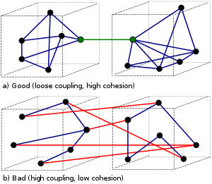
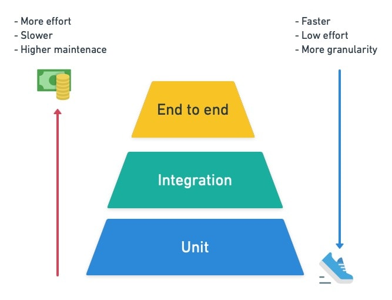

# Теоретический минимум для QA

## Вступление

Эта книга для тех, кто хочет начать карьеру QA без какого-либо бэкграунда. Также подойдет для программистов, но в меньшей степени, так как от них обычно требуются более глубокие знания. Подойдет и просто для интересующихся.

В интернете огромное количество информации, курсов, книг и статей, однако, кажется, есть недостаток ресурсов для стопроцентных новичков. Хотелось объяснить все самое главное, излишне не пускаясь в технические подробности. Я постарался написать книгу так, чтобы она была хорошей отправной точкой, включающей все нужные темы, но при этом оставаясь насколько возможно компактной.

Мы не будем в деталях касаться того, как работают программы, как устроено бинарное исчисление, архитектура компьютера и так далее. Цель этой книги - постараться остаться на более высоком уровне абстракции, том, который обычно необходим в работе новичка. По мере развития в профессии можно будет вернуться к нужным темам и изучить их, но это руководство ставит целью разобраться на уровне, достаточном для работы. При этом я постарался уделить внимание принципиальным вопросам и вопросам новичков, которые которые порой имеют более важное значение, чем технические подробности. Предполагается, что читатель - обычный "уверенный пользователь" ПК, который пользовался Windows, может что-то загуглить, понимает основы того, как работает сеть, интернет, как установить программу и так далее.

В тексте встречается достаточно много упрощений и неточностей, которые, я надеюсь, не введут в заблуждение и позволят сосредоточиться на главном. Иначе пришлось бы всюду ставить сноски и отвлекаться на незначительные для текущей цели детали. Главное, помните, что это не истина в последней инстанции, а только отправная точка. Если кто-то поправит вас в каком-то утверждении, данном здесь, то вполне вероятно, что он прав. Если в тексте встретятся незнакомые вам слова (хотя я постарался сохранить последовательность изложения), то не переживайте об этом - они не влияют на дальнейшее понимание.

## Понимание программ

### Что такое программа

*Программы* выполняют полезную работу и взаимодействуют друг с другом. Программа подобна математической функции: имеет *входные данные* (аргументы), *выходные данные* (результат) и производит какую-то работу. Например, для функции `f(x) = x^2` вход - это число x, выход - это x в квадрате; для числа 2 она выдаст 4, для 3 - 9 и так далее. Программы делают то же самое, но работают не только с числами, а также со строками, графическими объектами и различного вида данными. Например, компьютерная игра - программа, у которой вход - движения мыши и нажатия клавиатуры, а выход - графическое изображение на экране. Внутри она раскладывается на множество компонентов, которые выполняют сложную работу, но сути это не меняет. У программы может быть не один, а несколько входов и выходов: например, другая многопользовательская игра принимает движения мыши, клавиатуры, данные по сети от других игроков, а выдает изображение, пересылает данные прочим игрокам по сети и пишет в файл на жестком диске вспомогательную информацию.

Примеры программ:

* Какая-либо графическая программа (которые обычно запускает пользователь): аудиопроигрыватель, браузер, текстовый редактор
* Консольное приложение
* Веб-сайт
* Веб-сервер
* Система управления базами данных

Примеры входов:

* Движения мыши
* Нажатия клавиатуры
* Аргументы командной строки (см. [Linux](#работа-в-linux))
* Файл
* Стандартный ввод, [stdin](#работа-в-linux)
* [Сигнал](#работа-в-linux) операционной системы
* [Другая программа](#работа-в-linux)
* Сетевое соединение
* База данных

Примеры выходов:

* Движения мыши и нажатия клавиатуры (программа-автокликер)
* Файл
* Стандартный вывод, [stdout](#работа-в-linux)
* Сигнал операционной системы
* Другая программа
* Сетевое соединение
* База данных
* Графическое изображение на экране

В общем, то, что является выходом, может быть и входом, все зависит от задач программы. Вход - то, от чего отталкивается программа при генерации выхода. Программа не обязана иметь графический интерфейс, а может только консольный (с которым вам придется работать, см. [далее](#работа-в-linux)).

Программы существуют в трех состояниях:
1. *Исходные коды* - текстовые файлы, из которых создаются исполняемые файлы (состояние 2).
2. Один или набор *исполняемых файлов* на жестком диске (или на оптическом диске, флешке и любом другом носителе). В таком виде программа не работает, а просто хранится, чтобы быть в будущем запущенной.
3. Запущенная программа, выполняющая работу (*процесс*). Она загружается операционной системой с диска в оперативную память и выполняется. Ресурсы, доступные в этом состоянии программе, называются рантаймом (runtime). Например, если программа в начале работы загружает конфигурационный файл, но затем параметры нельзя изменить, то они недоступны для изменения в рантайме.

При этом исполнение может происходить в двух режимах:
1. Программа не завершается, пока ей каким-либо образом об этом не сказать (например, нажать крестик в углу окна).
2. Программа завершит работу, как только выполнит задачу (так работают многие консольные утилиты).

После завершения работы программа удаляется из оперативной памяти и остается храниться только на диске (2).

### Трансляторы

*Трансляторы* - программы, которые нужны для того, чтобы конвертировать программы из исходных кодов (1) в исполняемые файлы (2). Трансляторы бывают двух видов: интерпретаторы и компиляторы (опустим пример Java, С# и других подобных языков, где используется нечто среднее). Для интерпретаторов исходные коды также являются и исполняемыми файлами (1 = 2), то есть не создается дополнительных файлов, а исполняются исходные коды при каждом запуске программы. Компиляторы же по-честному создают исполняемые файлы. Для нас это различие не важно - просто полезно, чтобы не запутаться в терминах. Важно понимать цепочку: программист написал исходный код - транслятор создал из него исполняемые файлы - операционная система загрузила исполняемые файлы - программа работает.

### Язык программирования

Исходные коды пишутся на языке каком-либо программирования. *Язык программирования* - специальный язык, который достаточно формален, чтобы из него мог создать исполняемый файл транслятор, но при этом достаточно понятен для человека, чтобы комфортно выражать на нем свои идеи. Существует много разных языков для разных целей, вот самые популярные:

* Python (интерпретируемый) - веб-разработка, анализ данных, написание тестов QA, написание скриптов системными администраторами и много чего еще. Один из самых популярных, простых в освоении и удобных в использовании языков, хорошо подходит на роль первого языка для изучения.
* PHP (интерпретируемый) - веб-разработка [бэкендов](#web). Теряет популярность. Я бы советовал предпочесть Python, но может быть, с PHP будет проще найти первую работу веб-разработчику.
* Javascript (интерпретируемый) - веб-разработка [фронтендов](#web) (здесь он доминирует), веб-разработка бэкендов, написание тестов QA (реже). Стандарт де-факто для фронтенда, но завоевал популярность и на бэкенде благодаря Node.js. Уступает Питону в удобстве использования и богатстве стандартной библиотеки.
* Java и C# (нечто среднее между компилируемым и интерпретируемым) - корпоративный софт и крупные прикладные приложения, тесты QA (реже Python, чаще JS).
* C/C++ (компилируемый) - написание системного ПО и высокопроизводительных приложений. Намного сложнее учить, медленнее скорость разработки и более чувствителен к ошибкам программиста. Поэтому на C/C++ не пишут все подряд, а используют другие языки.

Почему существует так много языков программирования? Из-за существования разных задач, по историческим причинам, из-за желания реализовать те или иные подходы в программировании или по соображениям конкуренции. Но вас, вероятно, будет интересовать какой-то язык из первых четырех пунктов.

В принципе, язык можно использовать и в нетипичной нише, если это нужно, но при этом быть готовым к дополнительным трудностям (что-то будет работать плохо, разработка займет больше времени).

### Командная оболочка

Запускается как `cmd.exe` или Командная строка в Windows, а в Linux обычно называется Терминал. Это просто альтернативный инструмент ввода информации, к которому надо привыкнуть. Дает богатые возможности автоматизации рутинных задач, чего сложно добиться для графических приложений. Команды вводятся клавиатурой, а мышь не работает или имеет ограниченное применение. Необходимо приобрести некоторые навыки работы с оболочкой, чтобы эффективно работать (см. для [Linux](#работа-в-linux)).


## Элементы языков программирования

Языки программирования имеют в своей основе много общего. Не стоит пугаться подробностей языка при чтении учебников или пытаться выучить все тонкости, имена функций и так далее. Чтобы начать работать, нужно знать немного, а лучше всего изучать язык на практике. Общее правило: если что-то непонятно, запустите интерпретатор и поэкспериментируйте.

Как запустить интерпретатор Python:

1. * Для Windows: [скачать](https://www.python.org/downloads/) Python и установить.
   * Для Linux (Ubuntu): ввести в терминале `sudo apt install python3`.
2. В командной оболочке ввести: `python3`.

Здесь представлен необходимый минимум конструкций, который позволит начать писать простые программы или тесты QA.

### Комментарии

Комментарии игнорируются транслятором - они нужны прежде всего для человека, чтобы уточнять что-то непонятное в коде.

### Порядок выполнения

Программа выполняется строчка за строчкой (за некоторыми исключениями, перечисленными ниже). Точкой входа (первой строкой, с которой начинается выполнение) является в разных языках либо первая строка функции main, либо просто первая строка запущенного файла (в случае Python), а точкой выхода соответственно - последняя строка функции main / запущенного файла. Исключениями являются:

* Вызов функции. Встретив функцию, программа начинает выполнять ее построчно, а дойдя до конца функции (либо встретив конструкцию return), программа возвращается на место, где была вызвана функция, и продолжает выполнение оттуда.
* Оператор `if` и `if-else` - выполняет одну из веток, в зависимости от того, верно ли условие.
* Операторы цикла: `while`, `for` и некоторые другие - повторно выполняет тело цикла, пока верно условие.
* Функция выхода из программы (в Python `sys.exit()`) - прекращает выполнение программы.

Пример на Python:
```
import sys # если не напишем, то не сможем использовать sys.exit (см. главу про модули)

# Комментарии в Python начинаются с решетки.
# Объявление функции, my_func - произвольное имя.
def my_func():
  print("2") # Тело функции задается в Python отступом. Для my_func тело - это 3 строки, включая текущую.
  return
  print("222") # Последняя строка функции, которая при этом никогда не будет выполнена. Здесь кончается тело функции.

print("1")
my_func()

if True:
  print("3")
else:
  print("333")

# Переменные пока не объяснялись, но без них сложно показать цикл.
# Смысл просто в том, что цикл while выполнится дважды: со значениями i, равными 4 и 5.
i = 4
while i < 6:
  print(i)
  i = i + 1

sys.exit()
print("666")
```
Выведет: 1 2 3 4 5

После прохождения точки выхода программа завершает свою работу.

Ранее мы говорили, что есть программы, которые завершают работу сразу, а есть, которые ожидают закрытия. И те, и другие выполняются одинаковым образом и имеют точку выхода. Однако, если первые выполняются без каких-либо хитростей, то чтобы удержать второй тип программ от закрытия, используются специальные техники. Например, это может быть вызов специальной библиотечной функции, который останавливает исполнение программы на строчке вызова. Программа при этом продложает исполняться в другом потоке (сейчас не важно, что это такое), но в то же время не завершается. Это все сейчас не важно, кроме тех двух принципиальных фактов, что любая программа выполняется в основном последовательно, и что на какой-то из строк выполнение может задержаться неограниченно долго, если это зачем-то нужно. Другие примеры, когда может быть нужно задержать выполнение, ожидая получения данных: функция Python `input()`, которая читает данные, введенные из консоли, или `socket.recv()`, которая читает данные по сети.

### Переменная

Переменная нужна, чтобы записать в нее какое-либо значение. Это может быть число, строка, булевая переменная (имеет только два значения: True и False) и другие типы данных. Запись происходит посредством оператора присваивания (`=`).

Переменная будет хранить значение на протяжении всего срока жизни (если его не удалить или не присвоить другое значение). Не вдаваясь в детали, скажем, что переменная объявлена либо внутри какой-либо функции (чаще всего) - это локальная переменная, либо вне ее, и тогда это глобальная переменная. Глобальная переменная имеет срок жизни до конца работы программы, а локальная - до конца выполнения функции (это выполнение `return` или последняя строчка этой функции).

### Функция

Функция нужна, чтобы вызывать какую-либо последовательность команд (синоним - "участок кода") повторно в разных местах программы (хотя иногда функцию создают, даже если код внутри нее вызывается только один раз - для [практик](#программирование-следующие-шаги) хорошего кода). Чтобы вызывающий код мог передать функции какие-то значения, существуют аргументы функции; а чтобы она могла передать значения коду, существует результат выполнения функции. Время жизни аргументов такое же, как и у локальных переменных. Функция не всегда возвращает какое-то значение, а иногда работает ради побочного эффекта - изменений среды за пределами функции: например, запись в файл, базу данных, отправка данных по сети и так далее. Либо возможна комбинация возвращаемого значения и побочного эффекта.

```
def f1(arg1 = 3): # Можно задавать аргументы по умолчанию, они используются, если функция
                  # была вызвана без аргументов. В Python есть много удобных синтаксических
                  # возможностей для аргументов: именованные аргументы, args, kwargs.
                  # Изучите их потом самостоятельно - они точно пригодятся.
  var1 = arg1 + 1
  return var1
  # за пределами тела f1 нет доступа к var1 и arg1

def f2(arg2):
  var2 = arg2 + 2
  return var2
  # за пределами тела f2 нет доступа к var2 и arg2

# Выведет 5 (3 + 2 + 1).
# Хотя мы ничего не передали в f2, передался аргумент по умолчанию (3).
print(f1(f2()))
```

Функция может вызывать другую функцию, которая в свою очередь вызывает третью, и так далее.

Другое синонимы слова функция - процедура, подпрограмма.

Функции, не имеющие имени, называются лямбдами. Они нужны для более удобной передачи функций в качестве параметров других функций (что удобно на практике - позволяет легко создавать гибкий код). В Питоне разрешены только однострочные лямбды. В остальном это точно такие же функции.

```
# f1 и f2 полностью равнозначны, хотя f1 - это переменная, в которую помещена функция,
# а f2 - это название функции. Но не во всех языках разрешена такая гибкость.
f1 = lambda a: a + 1

def f2(a):
  return a + 1
```

Есть также понятие оператора - это сходная по смыслу с функцией конструкция, но задается на уровне синтаксиса языка и иногда имеет более сложную структуру. Например, оператор `+` складывает два числа - он мог бы быть функцией, но имена функций в Python не могут включать символ "плюс". А например, оператор `if` выпоняет только одну из ветвей - и он уже не мог бы быть функцией с тем же удобством.

```
def branch1():
  print("1")
  print("2")

def branch2():
  print("3")
  print("4")

def my_if(condition, b1, b2):
  if condition:
    b1() # Нам пришлось использовать функции, чтобы достичь эквивалентного кода, т. к.
         # иначе не получилось бы передать несколько строк,
         # и при этом выполнились бы обе ветви, а не только одна. В общем, неудобно.
  else:
    b2()
```

Еще один схожий с функцией термин: метод - это функция в составе класса, он будет рассмотрен в разделе про [ООП](#ооп).

Функции, переменные и классы назовем общим словом программые сущности (такого термина нет, ввел его просто для удобства).

### Модуль

В разных языках модули устроены по-разному, поэтому примем для простоты, что в Python модуль - это всего лишь файл, в котором находятся программные сущности. Модули нужны для удобной организации кода подобно тому, как папки нужны для удобной организации файлов. Чтобы использовать модуль, его нужно импортировать командой `import`. Пакеты в Python устроены чуть сложнее - это уже каталог с модулями. При этом помните, что в других языка слова "модуль" и "пакет" могут обозначать нечто немного другое, или могут быть другие обозначения, например, "namespace" (пространство имен).

Тонкости могут отличаться, но общая идея в том, что модули / пакеты / неймспейсы / что-то еще нужны для организации кода по отдельным разделам.

### Область видимости

Каждая программная сущность имеет область видимости - те строки кода, в которых к ней можно обратиться. В разных языках правила области видимости могут отличаться. Стоит либо попробовать запустить спорный пример, либо посмотреть ответ в документации. Примерные правила такие:

* Чтобы сущность из другого модуля стала видна, ее нужно импортировать (команда `import`).
* Глобальная сущность видна во всем модуле.
* Локальная сущность видна только внутри функции.
* Локальная сущность может перекрывать глобальную, если у них одинаковое имя.

Вероятно, эта часть будет плохо понятна в теории: просто попробуйте создать несколько программ, где будут использоваться модули, локальные и глобальные сущности и поэкспериментировать с ними.

### Циклы

Циклы - конструкции, необходимые, чтобы написать какой-то нетривиальный алгоритм. В Питоне циклы нужны не так часто, так как их зачастую заменяют списковые включения (for comprehensions).

Не буду подробно описывать работу циклов, так как вряд ли смогу сделать это лучше, чем уже есть:

* [While](https://pythontutor.ru/lessons/while/)
* [For](https://pythontutor.ru/lessons/for_loop/)

### Стандартная библиотека

В стандартной библиотеке содержится множество программных сущностей, необходимых для работы с разными задачами. Импортируются они так же, как и собственные модули - командой `import`. Некоторые, наиболее часто используемые сущности не нужно импортировать (например, функция `str` в Python или тип данных `list`). Сущности стандартной библиотеки могут быть написаны на другом языке программирования (более быстром), а могут и на том же - для пользователя они будут выглядеть одинаково.

Если в стандартной библиотеке не оказалось нужного модуля, то может помочь сторонний репозиторий пакетов. Для Python это [PyPI](https://pypi.org/). Программа `pip` - это менеджер пакетов, который может установить пакеты оттуда. В других языках будет другой менеджер пакетов, но принцип остается одинаковым: стоит писать как можно меньше кода, используя готовые пакеты, и отдавать предпочтение стандартной библиотеке.

### Типы данных

Есть простые и составные типы данных. С простыми все более-менее понятно - это числа, строки, булевы значения и так далее. Мы не будем рассматривать их внутреннее устройство, скажем только, что для каждого типа данных есть свой набор функций и операторов в стандартной библиотеке.

Составные типы данных - более интересная тема. В каждом языке их разный набор, но суть остается той же: разные типы данных нужны для разных целей. Каждый тип данных имеет обширный набор методов и операторов: добавить элемент, получить, удалить и много других. Для примера рассмотрим типы данных Python:

* Списки нужны для хранения нескольких объектов в одной коллекции. Обращение к элементу списка происходит по числовому индексу, вроде "получить пятый объект" - `my_list[4]`. 4, а не 5, так как нумерация начинается с нуля, а не единицы.

* Словари нужны для хранения нескольких объектов с доступом по произвольному ключу, а не только по числовому индексу. В 95% нужен доступ по строке. В остальном сходны со списками.

* Кортежи похожи на списки, но имеют неизменяемое значение. Это значит, что мы можем однажды создать кортеж, но не можем добавить и удалить из него элементы. Также, когда нужно вернуть не одно, а несколько значений из функции, обычно для этого используются кортежи (вернуть кортеж со значениями равносильно тому, чтобы вернуть несколько значений). Кортежи потребляют меньше памяти, чем списки, поэтому если достаточно неизменяемого значения, то стоит отдавать предпочтение им.

* Множества - это коллекции уникальных элементов. Можно добавить элемент, проверить, есть ли элемент в множестве, пересекаются ли два множества и так далее. Похожи на математические множества. Используются, когда необходимо работать с уникальными значениями, например, в каком-то алгоритме убрать дубликаты данных.

В других языках типы данных несколько отличаются. Например, в PHP нет списков, а существуют только словари (называемые ассоциативными массивами). В случае, когда нужен список, используется ассоциативный массив с ключами - числами. А в Java существует несколько типов словарей (`HashMap`, `TreeMap` и другие), выбираемых под конкретную задачу, исходя из знания устройства этого типа данных. Хотя обычно используется `HashMap`, и он эквивалентентен словарям Python.

Вот примерный список соответствий:

| Язык / тип данных Python | Список              | Словарь            | Кортеж                       | Множество          |
| ------------------------ | ------------------- | ------------------ | ---------------------------- | ------------------ |
| PHP                      | Нет / ассоц. массив | Ассоц. массив      | Нет                          | Ds\Set             |
| Javascript               | Массив              | Объект             | Нет                          | Set                |
| Java                     | ArrayList           | HashMap            | Collections.unmodifiableList | HashSet            |
| C++                      | std::vector         | std::unordered_map | const array                  | std::unordered_set |


При этом дело осложняется тем, что для разных типов в разных языках могут быть использованы одни и те же термины, а для одинановых - разные. Например, список в Java - это другая структура данных, а списку Python соответствует `ArrayList`. Словари же в разных языках называются таблицами (map), ассоциативными массивами и даже объектами в случае Javascript. В общем, нужно быть аккуратным, такая терминологическая путаница - обычное дело в компьютерных технологиях.

Чтобы хорошо разобраться в тонкостях структур данных и понять, какую из них использовать в каком случае, нужно изучить вводных курс по алгоритмам и структурам данных. Но для начинающего QA это точно не приоритетная задача.

В Python и некоторых других языках не существует ограничений на типы данных в коллекциях. То есть, например, первым элементом списка может быть строка, вторым - число, третьим - другой список и так далее. В других языках, таких как Java и C++, оно есть. Но в большинстве случаев вам будут нужны именно объекты одного и того же типа в коллекциях. Обычно это хорошая идея, так как код, работающий с коллекцией однотипных элементов, проще для восприятия.

Стоит прояснить тонкое различие между присвоением переменной нового значения и изменением переменной. Существуют изменяемые типы данных: списки, словари, множества и другие, и неизменяемые: числа, строки, булевы значения, кортежи и другие. Неизменяемый тип данных нельзя изменить, но можно присвоить переменной с ним новое значение. Константы - это неизменяемые переменные (в Питоне их нет).

```
l1 = (1, 2, 3) # кортеж
l2 = [1, 2, 3] # cписок

l1 = l1 + (4, 5) # "сложить" два кортежа (это называется "конкатенация")
                 # и поместить итоговое значение в l1

l2.append(4) # добавить в l2 элемент со значением 4
l2.append(5)
# в итоге в обоих коллекциях элементы - 1, 2, 3, 4, 5, но в случае изменения
# списка мы обошлись без присвоения
```

### Другие темы

За бортом осталось несколько важных тем: [обработка исключений](#исключения), декораторы, настройка venv, а ООП и классы будут рассмотрены позже. После некоторой практики точно стоит освоить списковые включения, методы работы со списками, словарями и строками, list slicing, итераторы. Для совсем продвинутых: data classes, itertools и так далее. Для форматирования строк используйте f-strings (совет, чтобы не запутаться, так как в Python несколько способов сделать это).

На мой взгляд, главное - больше практики и экспериментов, меньше штудирования учебников и страха, что что-то не до конца знаешь. К теории всегда можно вернуться, столкнувшись с конкретными трудностями. С одной стороны, это только вершина айсберга, с другой - это именно то подмножество языка, с которым вы будете работать чаще всего. Остальное может не пригодиться, забыться, а времени на это будет потрачено немало. Какой стиль обучения выбирать - решать вам.

## Сеть

### Терминология

Компьютерная сеть, в самом простом понимании, - это интерфейс, по которому компьютеры попарно обмениваются данными. Пример на псевдокоде (в настоящем Python функции бы вызывались немного иначе и код был бы сложнее):

```
# компьютер 1, клиент
SERVER_IP = "192.168.0.2:8765" # IP и порт часто указываются одной строкой, через двоеточие
send(SERVER_IP, "12345")
```

```
# компьютер 2, сервер
data = recv() # Ожидаем данные от какого-то подключения.
              # Пока данные не будут получены, программа не пойдет исполняться дальше
              # и будет находиться на этой строчке.
print(data) # Выведет 12345
```

Компьютеры, взаимодействующие по сети, традиционно называются узлами или нодами (node). Клиент - это нода, которая отправляет запрос (request), а сервер - которая получает запрос от клиента и формирует на его основе ответ (response). Так происходит клиент-серверное взаимодействие, это называется клиент-серверная архитектура. За обилием терминов не скрывается ничего сложного (как это часто бывает).

Чтобы компьютеры могли обращаться друг к другу, используются специальные идентификаторы: IP адреса и порты. IP адрес идентифицирует саму машину, а порт - программу, запущенную в конкретный момент времени на машине. Две программы на одной машине не могут одновременно присваивать себе один и тот же порт - операционная система не даст этого сделать (выдаст ошибку типа "Port in use").

Домен сайта, например, google.com - это синоним IP порта, существующий только ради удобства пользователя (компьютеру бы хватило только IP адресов). За трансляцию доменных имен в IP адреса отвечает протокол DNS.

### Асинхронность

В контексте сетевых запросов часто упоминают об асинхронности. В примере выше код синхронный, то есть программа не пойдет дальше, пока не получит данные. Более эффективный способ - это асинхронные сетевые запросы. Они не ждут данные, а используют для этого другие техники программирования, например, лямбды.

```
# компьютер 1, клиент
SERVER_IP = "192.168.0.2"
send_async(SERVER_IP, "54321")
```

```
# компьютер 2, сервер
recv_async(lambda data: print(data)) # распечатает 54321, когда данные будут получены
sleep(10) # Чтобы программа не закончила выполнение раньше получения данных, нужно все равно
          # заблокировать поток выполнения, для этого говорим программе спать 10 секунд.
          # Не обращайте на эту строку особого внимания, она нужна только для полноты картины.
print("Done") # Выведет Done через 10 секунд
```

Асихронными могут быть не только сетевые запросы, но и обращения к базе данных, файловой системе - к чему угодно, где ожидаются значительные временные задержки. Широко используются асинхронные сервера (например, Node.js), в Python для работы с асинхронностью используются конструкции `async/await`. Но это более продвинутая тема, которая вам пока не нужна.

### Протоколы

Сетевой протокол - это способ компьютеров взаимодействовать по сети. Чтобы организовать сеть, нужно множество протоколов:

* Физический уровень. Взаимодействие c физической средой: Wi-Fi, Ethernet.
* Сетевой уровень. Выбор маршрута, по которому будут передаваться данные: IP. Данные в глобальной сети передаются не от ноды к ноде напрямую, а через множество промежуточных нод: роутеров, маршрутизаторов и так далее.
* Транспортный уровень. Создание устойчивого канала связи, в котором сообщения гарантированно передадутся, несмотря на помехи: TCP.
* Прикладной уровень. Протокол под конкретные нужды того или иного приложения: HTTP, WebSocket, FTP, BitTorrent, SMTP.

Протоколы каждого из уровней опираются на протоколы предыдущего уровня, образуя иерархию. В идеализированном виде она называется модель OSI и включает семь уровней, но на практике их обычно 5. В списке выше не хватает одно из уровней - канального, но нам не особо важна теоретическая строгость, а важна общая идея. Программисты обычно программируют на прикладном или транспортном уровне, а все, что ниже - забота сетевых администраторов.

Также на практике в 99% случаев для сетевого уровня используется протокол IP, а для транспортного - TCP или UDP. Эта связка называется соотвественно TCP/IP или UDP/IP.

TCP - это протокол с защитой от ошибок, который используется для передачи важных данных. На нем построено большинство прикладных протоколов, с которыми нам придется работать: HTTP, WebSocket. UDP - более быстрый протокол для приложений, часть данных которых при плохой связи может быть утеряна без особого вреда, например, видеостриминг, аудиочаты и так далее (будет плохое изображение или связь - не страшно; с другой стороны - важно отсутствие задержки, трансляция в реальном времени). Программная сущность для работы с TCP или UDP называется сокет (socket).

HTTP - протокол для сайтов и веб-приложений, используется браузерами и веб-серверами (программами, обслуживающими работу сайтов). Протокол имеет текстовый формат, то есть довольно легко читается подготовленным человеком. А бинарные протоколы сложно читать без дополнительного софта, но зато они более компактные и экономят интернет-траффик.

HTTP не устанавливает долгосрочное соединение, то есть клиент отправляет только один запрос и получает на него только один ответ. Чтобы отправить следующий запрос, нужно открыть новое соединение. Сервер, в свою очередь, не может сам отправить данные клиенту в произвольный момент времени, если захочет это сделать. Чтобы преодолеть это, раньше использовались разные обходные пути (long polling, COMET), но сейчас есть WebSocket, и скорее всего, вы столкнетесь с ним.

WebSocket - протокол для полноценного двустороннего (полнодуплексного) взаимодействия браузера и сервера. Изначально он создавался именно как браузерная технология, так как обычные приложения (а не веб-сайты) могли использовать обычные сокеты.

## Web

### История развития и основные идеи

Идеи веб-программирования, наверное, проще и нагляднее всего рассказать в историческом контексте.

Изначально идея веб была очень простой: статические HTML документы лежат на веб-серверах, а пользователи обращаются к ним через браузеры. Странички распределены между множеством компьютеров и на них хранится в основном текст: научные статьи, резюме, домашние странички. Где-то в это же время появляются первые поисковики, которые индексируют страницы и выводят удобство пользования интернетом на новый уровень.

Постепенно добавляются новые возможности: форматирование текста и шрифты, добавление картинок, а позже аудио и видео. Появляется CSS как отдельный язык описания внешнего вида, а HTML постепенно идет к тому, чтобы отражать только структуру документа, делегировав задачу внешнего вида CSS. Но до сих пор можно встретить, например, теги `<b>` и `<i>`, отвечающие за внешний вид текста. Разделение обязанностей между HTML и CSS не получилось 100%-ным, но близко к этому. Разделение структуры и внешнего вида документа также позволяет для разных устройств (браузер, телефон, электронная книга) отображать сайт по-разному.

Параллельно развивается возможность использовать генерацию динамического HTML, а не только ограничиваться статическими страницами. Сайты, как программы, работают по следующему принципу:

* Веб-сервер получает от браузера HTTP запрос ("хочу получить страницу по такому-то адресу", "хочу отправить сообщение на форум с такой-то темой" и так далее). Он выполняет всю рутинную работу (анализ HTTP запроса, организация работы нескольких сайтов на одном сервере и другое) и передает данные HTTP запроса сайту.
* Сайт на основе HTTP-запроса выбирает, что ему нужно сделать. Например, показать определенную HTML страницу, сгенерированную на основе данных, введенных перед этим другими пользователями и сохраненных в базе данных. Или, если это запрос на сохранение, то сохранить эти данные, если они введены корректно. После обработки каждого запроса программа, как правило, прекращает работу, поэтому, чтобы сохранить состояние между ними, нужно пользоваться вспомогательными инструментами (база данных, куки, сессии и так далее).
* В итоге браузер получает обычную HTML страницу, никак не обращая внимание на тот факт, что она была сгенерирована. То есть для него нет разницы, статическая на той стороне страница или нет. HTML страница может также содержать ссылки на CSS таблицы и Javascript файлы, в этом случае браузер также их считает.

В какой-то момент появляется идея добавить к HTML и CSS язык программирования, чтобы иметь возможность использовать анимацию, немного изменять содержимое страницы без отправки дополнительных сообщений веб-серверу и так далее (Javascript). Так в браузерах появляется первая возможность писать программы.

Javascript программа в браузере работает в несколько другой модели, чем описывалось ранее: она не завершает работу, пока открыта HTML страница. При загрузке страницы обычно регистрируются обработчики разных событий (клики мыши на разных кнопках, отправка форм, переход по ссылкам), которые вызывают тот или иной код, в зависимости от действий пользователя. Таким образом, эти обработчики являются несколькими точками входа программы. Такой подход называется событийно-ориентированной парадигмой.

Пример кода на Javascript, обрабатывающий отправку формы:

```
var save_button = document.querySelector("#save-form") // см. ниже про работу с DOM
var save_button = document.querySelector("#form")
save_button.addEventListener("click", () => {
  var data = get_data(form)
  // отправить методом POST данные формы на бэкенд (см. ниже методы HTTP протокола)
  send_to_server("https://192.168.0.3/save_form", "POST", data)
  // эта функция, например, отобразит текст пользователю в специальном окне
  message_to_user("Данные были отправлены!")
})
```

Спустя какое-то время, в Javascript добавляется возможность, которая несколько меняет способ функционирования сайтов - AJAX. До этого запрос к веб-серверу инициировался браузером, а не пользовательским кодом на самой странице. Например, ввод адреса в адресной строке и нажатие Enter иниицирует HTTP запрос. Нажатие кнопки "Отправить" на странице с формой ввода также иницирует запрос, но для этого не используется Javascript, все работу полностью выполняет браузер, который знает, как работать с HTML формами. То есть, работает только связка: браузер + HTML + HTTP + веб-сайт. Теперь же сама Javascript программа на стороне клиента может инициировать запрос на сервер (в зависимости от каких-либо условий, от нажатия по кнопке или чего-либо еще - это зависит от конкретной программы). Эта возможность называется XMLHttpRequest. Получается некая рекурсия, что сперва браузер загружает HTML+JS страницу, но затем эта страница может сама отправлять запросы. Это меняет подход к построению сайтов и делает их более интерактивными. 

Другой необходимый компонент AJAX - это манипуляция содержимым страницы, так как без этого не было бы большого смысла делать дополнительные запросы. DOM модель позволяет изменять, добавлять и удалять элементы, а также предоставляет удобный интерфейс их поиска. Позже добавляется технология WebSocket, делая удобной двустороннюю коммуникацию между браузером и сервером.

Таким образом, однажды загруженная страница начинает жизнь своей жизнью в браузере и видоизменяться в зависимости от того, как будет работать ее Javascript программа. При закрытии страницы (например, при переходе по ссылке в той же вкладке браузера) она выгружается (подобно тому, как выгружается завершившая работу программа) и цикл повторяется заново.

Javascript имеет богатые возможности, позволяющие манипулировать содержимым страницы и браузером. Например, Javascript может подменить адресную строку при нажатии на ссылку, но при этом не будет произведено нового HTTP запроса. Однако если вы перезагрузите страницу с этим адресом, то фронтенд загрузится заново, затем проанализирует адресную строку, запросит у бэкенда все нужные данные и вернется к тому же состоянию, что и было, а вы при этом не заметите ничего необычного. Далее будет рассказано, как глубже проанализировать работу фронтенда при помощи [Chrome DevTools](#chrome-devtools).

В своем предельном значении эта идея стремится к Single Page Application (SPA) - современному подходу, когда страница загружается однажды, но затем вся работа в приложении уже происходит через AJAX. В подходе SPA HTML страница снова становится полностью статической, но с изрядным количеством Javascript кода, делающего ее полноценным клиентским приложениям. Теперь веб-сервер обслуживает два сайта: один загружается статически и содержит только HTML+JS+CSS (фронтенд), а другой (бэкенд) так же, как и раньше, динамически отдает по HTTP разные данные в зависимости от запроса, только теперь это не HTML страницы, а сырые данные (обычно в формате JSON, о котором позже).

Разделение бэкенда и фронденда позволяет разделить ответственность и сфокусироваться разрабочикам на определенной нише. Разработчики, которые совмещают работу с бэкендом и фронтендом, называются Full Stack.

Дополнительно усложняет дело то, что на фронтенде зачастую используются дополнительные технологии и языки программирования, которые конвертируются специальными трансляторами в HTML+CSS+JS. (Например, React JSX, Typescript, PostCSS. То есть исходными кодами здесь являются файлы JSX, *.ts и другие, а исполняемыми файлами - *.html, *.js и *.css, и средой выполнения программы, соответственно, - не операционная система, а браузер.) Также перед публикацией фронтенда код часто минифицируется - прогоняется через специальный транслятор, чтобы на выходе получился эквивалентный код, но меньший по количеству символов (для экономии траффика).

Во многом веб развивался стихийно и не самым лучшим образом, что сказалось на его противоречивой архитектуре. Долгое время существовала проблема совместимости браузеров, некоторые из которых могли не поддерживать тот или иной функционал Javascript и CSS или делать это по-разному. Сейчас эта проблема тоже существует, хотя и в меньшей степени. Существует специальный вид библиотек - полифиллы (polyfill), который призван решить проблему совместимости и привести функционал к единому стандарту.

В итоге веб развился в полноценную среду разработки, ничем не уступающую десктопным приложениям, и даже во многом оттеснившую их и ставшую стандартом де-факто в разработке приложений. На то есть ряд причин:

* Приложения удобно использовать в облаке, не храня данные локально, а имея к ним доступ из разных устройств.
* Не нужно писать приложения под разные платформы, так как все будет работать в браузерах.
* Не нужно писать систему обновлений, так как код изначально находится на серверах, а не на компьютере клиента.

### Бэкенд

Мы примерно поняли, как устроен фронтенд, теперь посмотрим, из чего состоит бэкенд.

Основные задачи бэкенда:

* Работа с [бизнес-логикой](#it-сленг-и-термины). Хотя здесь и возможны варианты частичного или полного переноса бизнес-логики на фронтенд, все-таки доминирует подход, при котором за нее отвечает бэкенд, насколько это возможно, а фронтенд берет на себя отображение пользовательского интерфейса.
* Решение задач производительности, масштабируемости, отказоустойчивости. Нередко нужно, чтобы приложение быстро работало, обслуживало много пользователей, как можно меньше ломалось и было всегда доступно для использования.
* Обеспечение безопасности. Весь код и данные фронтенда доступны для чтения в браузере, то есть в нем нельзя хранить чувствительные данные (пароли, адреса и так далее). Поэтому безопасность можно возложить только на бэкенд.

Бэкенд может быть выполнен в виде единой программы или разбит на несколько. Последний подход, огрубляя, называется микросервисной архитектурой. Этот подход применяется все чаще, так как дает ряд преимуществ:

* Команде проще работать с одним небольшим проектом и специализироваться на нем.
* Появляются дополнительные возможности по масштабированию приложения (на большее число пользоватей или запросов).
* Появляется возможность использовать разные языки программирования для разных задач.

Практически всегда бэкенду необходимо взаимодействовать с системами управления базами данных (СУБД). Это программы, которые нужны, чтобы обеспечить надежное хранение и быстрых доступ к данным для множества пользователей. Существует много разных СУБД для различных задач. Позднее мы рассмотрим реляционные базы данных и язык доступа к ним - [SQL](#sql).

Помимо СУБД (MySQL, MSSQL, PostgreSQL, MongoDB, Redis и другие), существует множество других програм, которые используются на бэкенде: брокеры очередей (Kafka, RabbitMQ), системы кеширования (Memcached) и так далее. С точки зрения QA, достаточно просто понимать, что:

* Эти системы имеют какой-то интерфейс обращения к данным [(CRUD)](https://developer.mozilla.org/en-US/docs/Glossary/CRUD): например, SQL или какой-то другой язык или [API](#it-сленг-и-термины). Этот интерфейс несложно изучить, и его стоит использовать в работе.
* Они нужны для каких-то специфических инженерных потребностей, о которых тестировщику не нужно знать.
* Все эти программы - разные вводы и выводы для приложений вашей компании (в них либо пишут, либо читают). Общение с ними, как правило, происходит по сети, но от программиста оно скрыто - он пользуется библиотечными функциями. Поэтому вполне возможно обращаться, например, к базе данных и через библиотеку языка программирования, и через консольный клиент.

Если программы находятся на одной машине, то им доступны дополнительные способы общения, предлагаемые ОС, такие как файлы, общая память, пайпы (pipes) и другие. Хотя, как правило, все равно используется сетевое взаимодействие через сокеты, потому что они оптимизированы для работы внутри одной машины без накладных расходов.

Вам, как правило, не придется читать код (ни бэкенда, ни фронтенда), но придется хорошо понимать бизнес-логику проекта, тестировать различные его API, а также уметь заглянуть напрямую в систему хранения данных. Во многом эти объяснения нужны только для того, чтобы не путаться в терминологии, понимать, о чем говорят на митингах и не пугаться обилия новой информации.

#### Логи

Про логи (текстовые журналы с диагностической информацией) нужно знать то, что как правило, программы бэкенда в них пишут, и их порой стоит читать и анализировать. Логи могут быть как просто в виде файлов на сервере, так и в виде централизованной системы с веб-интерфейсом (Grafana, Graylog и другие). Для системных приложений расположение файлов логов общепринятно и его можно загуглить (но они могут быть выключены или перенастроены на другое место), для собственных приложений компании его нужно узнать у коллег.

### Протоколы (часть 2)

Это продолжение темы про протоколы прикладного уровня, но уже в контексте современной веб-разработки. Каждый протокол имеет слабые и сильные стороны и сферу применения. Ниже собрана информация о некоторых наиболее популярных протоколах:

| Протокол  | Поддержка браузером | Текстовый | Полнодуплексный | Высокопроизводительный |
| --------- | ------------------- | --------- | --------------- | ---------------------- |
| HTTP      | +                   | +         | -               | -                      |
| WebSocket | +                   | -         | +               | -                      |
| gRPC      | -                   | -         | +               | +                      |

Протоколы нужны для передачи данных, но чтобы данные передать, их сперва нужно сериализовать. Сериализация - это приведение данных к виду, пригодному для передачи по сети. Существуют текстовые и бинарные виды сериализации. (Не стоит путать с текстовыми и бинарными протоколами. Например, по текстовому протоколу HTTP можно передавать бинарные данные в [теле ответа](#http), а бинарный протокол вполне может передавать текстовые данные.) Не вдаваясь в тонкости их устройства, скажем только, что текстовые данные легко читать, но их менее эффективно передавать по сети, а с бинарными ситуация обратная.

Самый популярный текстовый формат данных - [JSON](https://www.w3schools.com/js/js_json_datatypes.asp), менее популярный - XML. Из бинарных форматов популярен Protobuf, который обычно используют в связке с gRPC. Если необходимо отправить бинарные данные, как текстовые, то используется кодировка Base64.

Про протоколы вам тоже главным образом нужно знать то, как ими пользоваться (как сделать тот или иной запрос), а не зачем они нужны и тонкости их устройства. Хотя иногды бывает полезно и углубиться. Например, Protobuf генерирует файлы *.proto, и бывает полезно знать, откуда они берутся, и как их перегенерировать при возникновении проблем.

#### HTTP

HTTP протокол используется как для взаимодействия бэкенд-фронтенд, так и взаимодействия бэкендов между собой. Наверное, это самый популярный способ взаимодействия программ в вебе.

Протокол состоит из двух видов сообщений: запрос и ответ.

Пример запроса:

```
POST /genapp/customers/?id=123 HTTP/1.1
User-Agent: Mozilla/4.0 (compatible; MSIE5.01; Windows NT)
Host: www.example.com
Accept-Encoding: gzip, deflate
Content-Type: application/json
Content-Length: 345

{
   "customers":
  {
    "firstName": "Joe”,
    "lastName": “Bloggs”,
    "fullAddress": 
    {
        "streetAddress": "21 2nd Street",
        "city": "New York",
        "state": "NY",
        "postalCode": 10021
    }
  }
}
```

Пример ответа:

```
HTTP/1.1 200 OK
Date: Mon, 27 Jul 2009 12:28:53 GMT
Server: Apache/2.2.14 (Win32)
Last-Modified: Wed, 22 Jul 2009 19:15:56 GMT
Content-Length: 88
Content-Type: text/html
Connection: Closed
```

Каждое сообщение имеет заголовки (отчасти разные для запросов и ответов), такие как `User-Agent`, `Host`, `Date`, `Server` и другие. На начальном этапе вам не очень пригодится информация, зачем нужны заголовки и что они значат, достаточно знать, что с их помощью HTTP реализует много разных возможностей на уровне веб-серверов и браузеров. Некоторые заголовки определены стандартом HTTP и браузер или веб-сервер должны реагировать на них четко описанным образом, другие могут никак ими не обрабатываться и предназначаются для передачи данных веб-приложению.

Запрос содержит в себе метод запроса, большинство из которых отвечает за ту или иную CRUD операцию: POST (create), GET и HEAD (read), PUT и PATCH (update), DELETE (delete). В эпоху раннего веба использовались в основном только методы GET и POST. GET - для получения данных, а POST - для всего остального: добавления, редактирования и удаления. Браузер и сайт на чистом HTML, без AJAX, умели работать только с этими двумя методами. Сейчас, с распространением [REST](#rest-api), все чаще используются и остальные методы, но возможны разные варианты - зависит от конкретного приложения.

Опционально, сообщение может содержать тело (в примере выше - это данные JSON), в котором находятся передаваемые данные.

Данные по HTTP передаются несколькими способами: через заголовки, URL запроса (`/genapp/customers/?id=123` в примере) и тело сообщения. URL состоит (чаще всего) из следующих частей:

* Схема: `http://`, `https://`. HTTPS - это протокол с шифрованием данных посредством TLS (ранее SSL), в то время как HTTP передает незашифрованные данные. Практически любой современный сайт использует HTTPS. Если сертификат шифрования сайта устаревает или подменяется, браузер будет показывать ошибки типа "Your connection is not private".

* Хост (и иногда порт): `google.com`, `127.0.0.1:8080`, `fb.com:80`. Если порт не указан, то испольуется по умолчанию: 80 для HTTP, 443 для HTTPS. Если хост не указан (как в примере выше), то по умолчанию берется хост из заголовка `Host`, либо полученнный откуда-то еще, но общий смысл - хост текущего сайта.

* Путь (path): в примере выше - `/genapp/customers/`. Закрывающий слэш (`/`) может как присутствовать, так и нет - встречаются оба варианта, зависит от настроек веб-приложения.

* Параметры (query): данные ключ-значение, закодированные при помощи знака `=` и `&` и предваряемые `?`, например, `key1=value1&key2=value2`. В начале развития веб, путь отвечал за физическое раcположение документа на диске (`/path/to/file/some-page.html`), а параметры - за передаваемые значения (подобно аргументам функции или командной строки). Сейчас, когда веб-серверы и веб-приложения умеют работать с обоими частями URL как динамическими значениями, это различие стерлось: теперь и путь, и параметры, по сути, стали аргументами (на основе пути приложение решает, какую фунцию ему выполнить и какую страницу или данные отдать). В основном это используеся для нужд SEO (оптимизация сайтов под поисковики) и создания более легких для чтения URL-ов - другой принципиальной разницы между путем и параметрами сейчас нет. В случае [REST](#rest-api) путь используется для идентификации сущности [предметной области](#it-сленг-и-термины), а параметры - для дополнительных аргументов.

```
https://some-site.com/article/55
https://some-site.com/?article=55
```

Также стоит прояснить различие между GET-параметрами запроса и данными, передаваемыми через тело запроса методом POST. Казалось бы: и так, и так можно передать данные, зачем нужно два способа? На самом деле у методов GET и POST разный смысл, и первый должен использоваться только для чтения данных, а второй - для записи, иначе некоторые аспекты приложения могут работать неправильно. Параметры (даже в POST запросе) не должны использоваться для записи данных, а подходит только тело запроса.

* Якорь (fragment): `#some-id`. Эта часть URL не используется в HTTP, однако ее используют браузеры для навигации по документу (переводят экран на элемент с указанным идентификатором, см. [главу про DOM](#dom)).

Для самостоятельного изучения: пропущенные аспекты HTTP, которые нужны на практике чаще всего:

* Куки (cookies)
* Перенаправления (redirecting)
* CORS
* Для энтузиастов: HTTP-кеширование

##### REST API

REST API - это не протокол, а скорее набор устоявшихся практик, используемых при разработке HTTP приложений. Изначально он обозначал более сложный архитектурный подход (то, что вы найдете в Википедии), но впоследствии выродился в более простые правила. Вот они:

* Ресурс бизнес-логики унифицированно связывается с URL и как правило имеет идентификатор. Например, если у нас приложение, позволяющее добавлять и удалять книги, то вероятно оно будет иметь URL `/books/23`.
* Для CRUD манипуляций используются соответствующие HTTP методы. То есть, для получения списка книг будет использован запрос `GET /books`, дня получения конкретной книги `GET /books/11`, а для удаления `DELETE /books/50`.
* Данные в 99% случаях сериализуются в JSON, но самим REST это не определено.

Другой подход работы с HTTP - это GraphQL, чуть менее популярный.

### Фронтенд

Для того чтобы эффективно работать, стоит изучить основы HTML и JS в контексте работы браузера.

#### DOM

HTML представляет собой дерево элементов (тегов), где каждый элемент, кроме корневого, имеет родителя. Также элемент может иметь атрибуты (ключ - значение, то есть набор атрибутов для тега подобен словарю). Еще у тега может быть пара особых атрибутов: идентификатор (id) и класс (class). Они, как правило, используются для CSS селекторов, о которых будет рассказано ниже. Идентификатор определяет уникальный элемент на странице (если на странице два элемента с одинаковым идентификатором, то поиск по ним не будет работать корректно). Класс содержит список классов, разделенных пробелами. И идентификатор, и класс обозначаются произвольными строками.

Если описанное в предыдущем абзаце не очень понятно, дождитесь темы про DevTools и изучите на практике, экспериментируя с вкладкой Elements.

Браузер на основе HTML формирует DOM модель, где представляет HTML дерево в виде иерархии объектов. Каждый объект имеет методы и свойства (переменные), по которым можно получать и менять информацию в HTML дереве. Два самых главных метода, которые нас будут интересовать на практике - это `document.querySelector()` и `document.querySelectorAll()`. Они позволяют получать элемент или их набор по CSS селектору - это специальный небольшой язык запросов к HTML элементам. Вы можете изучить его синтаксис самостоятельно, а ниже перечислены самые употребимые варианты:

* `.some-class` - поиск по наличию класса (some-class и далее - это произвольная строка).
* `#some-id` - поиск по идентификатору.
* `div` - поиск по названию тега.
* `.first-class.second-class` - поиск по наличию двух классов в одном теге (здесь важно отсутствие пробела).
* `div.some-class` - поиск по тегу и классу элемента.
* `.ancestor-class .descendant-class` - первый класс должен быть у предка, а второй - у потомка, при этом между ними в иерархии могут быть или отсутствовать элементы. Например, и `<div class="ancestor-class"><div class="descendant-class">...`, и `<div class="ancestor-class"><div><span><div class="descendant-class">...` найдутся по этому селектору.
* `.parent-class > .child-class` - первый класс должен быть у родителя, а второй у ребенка. Например, `<div class="parent-class"><div class="child-class">...` найдется, а `<div class="parent-class"><div><div class="child-class">...` - нет.
* `[some-attr='value']` - поиск по значению атрибута.

#### Chrome DevTools

У Firefox тоже есть средства отладки со сходным функционалом, но остановимся на более популярном варианте - Chrome DevTools.

Открывается нажатием F12. Главные вкладки, которые нас интересуют:

* Elements. Здесь видно дерево HTML и как его элементы отображаются на странице. HTML доступен для редактирования. Самые полезные функции в контекстном меню:
  * Break On: остановит выполнение JS на изменении элементов - удобно, когда элемент постоянно пропадает и нужно его "поймать".
  * Store as global variable: элементом можно будет удобно манипулировать в консоли.
* Console. Здесь мы можем запускать произвольный Javascript код в контексте открытой HTML страницы. Например, если в JS файлах странице сохранены переменные, то мо можем их прочитать, введя их название, или можем манипулировать DOM этой страницы. Пара полезных конструкций:
  * `element.addEventListener()` - добавить обработчик события на некоторый элемент. Например, начать логировать клик по кнопке:
```
// temp1 - это DOM элемент кнопки, сохраненный через "Store as global variable".
// Но мы могли бы найти этот элемент и сами:
// var temp1 = document.querySelector("#some-button")

// вывести в консоль данные события в момент клика
temp1.addEventListener("click", _ => console.log("Случился клик"))
```

  * `element.dispatchEvent()` - искусственно запустить событие, как будто оно на самом деле произошло:
```
var event = new Event("click")
temp1.dispatchEvent(event) // в консоль выведется "Случился клик", хотя мы ничего не жали
```

* Network. Здесь можно просмотреть HTTP запросы, сделанные на странице (как инициированные Javascript, так и самим браузером).
* Application > Storage. Здесь можно посмотреть и изменить данные, сохраненные на стороне клиента. Это куки и другие специальные хранилища на стороне браузера, к которым разработчик обращается через функции Javascript.

Полезные настройки: Preserve log, Disable cache, Log XMLHttpRequests. В целом, в DevTools много отличного функционала, и если есть желание, поэкспериментируйте с ним.

## SQL

SQL - это язык манипулирования данными в рамках реляционной модели.

Базы данных, использующие SQL и реляционную модель, называются реляционными базами данных (а СУБД, соотстветственно, РСУБД). Это не единственный вид баз данных, но самый популярный. Различие между ними обсуловлено в основном способом хранения данных и различием в производительности при разных сценариях работы.

Что такое реляционная модель? Для нашего приближения это означает только то, что данные хранятся в таблицах, состоящих из колонок (columns) и строк (rows):

| id | name   | surname | date_of_birth | email          |
| -- | ------ | ------- | ------------- | -------------- |
| 1  | Антон  | Иванов  | 1980-01-02    | asd@gmail.com  |
| 2  | Сергей | Петров  | 1994-05-30    | xxx@yahoo.com  |
| 3  | Алена  | Серова  | 1951-06-16    | yyy@proton.com |

### Ключи

В реляционной модели существует понятие ключа. Ключ - это та колонка или набор колонок, по которым можно однозначно идентифицировать строку в таблице (то есть, ключ всегда должен быть уникален). В таблице выше это колонка id. Однако мы могли бы не создавать эту колонку, а вместо этого принять, что имя и фамилия образуют уникальное значение (что не всегда так). `id` - это пример синтетического ключа, а `name` + `surname` - пример естественного.

Ключи могут быть первичными и вторичными. Между ними нет особой разницы для пользователя, нужно только понимать, что обычно используются первичные ключи, а вторичные нужны, только если необходимо обеспечить дополнительную уникальность элементов (например, сделать `email` также уникальным). Существуют команды для создания и изменения ключей, но мы не будем их здесь рассматривать.

Также для числовых ключей существует механизм автоинкремента. Если указать его при создании таблицы, то при добавлении новых строк (команда `INSERT`) не нужно будет указывать ключ - он самостоятельно увеличится на единицу. В результате получаются таблицы, как таблица выше, с увеличивающимся на единицу значением ключа.

Еще стоит знать такой вид синтетических ключей, как UUID. Он имеет вид формата: 123e4567-e89b-12d3-a456-426614174000. Смысл этого ключа в том, что он генерируется каждый раз уникальным, но при этом для него не нужен автоинкремент, и таким образом его удобно использовать при работе с базой данных на нескольких нодах (она называется кластером).

### Схема

Данные в РСУБД строго типизированы, то есть нельзя, например, в `date_of_birth` записать произвольную строку, а можно только дату. Типизация в базах данных называется схемой (schema), а СУБД без необходимости строгой типизации называются schemaless (например, MongoDB).

Язык SQL, по большей мере, одинаков для всех РСУБД (MySQL, MSSQL, SQLite, PostgreSQL и другие), но также имеет и некоторые различия и специфичные команды для каждой РСУБД. Нас будет интересовать главным образом команда SELECT, используемая для извлечения данных (кстати, писать команды капслоком - это просто общепринятый стиль, для СУБД нет разницы в регистре команд).

### SELECT

В самом простом виде `SELECT` просто извлекает данные из таблицы:

```
-- извлечь все данные из таблицы с пользователями (выше)
SELECT * FROM users;

-- извлечь только имя и фамилию всех пользователей (используются псевдонимы)
SELECT u.name AS my_name, u.surname FROM users AS u;

 -- извлечь имя и фамилию пользователей с id больше 2
SELECT name, surname FROM users WHERE id > 2;

 -- ничего не вернет
SELECT * FROM users WHERE email = 'non_existing@gmail.com';

-- извлечь месяц рождения пользователей с именами, начинающимися на А
-- (используется функция MONTH)
SELECT MONTH(date_of_birth) FROM users WHERE name LIKE 'А%';
```

При этом можно извлекать данные не из таблицы, а просто получать константные значения или результат выполнения функий:

```
SELECT 123, CURDATE() FROM users;
```

Логика использования псевдонимов следующая: в простых случаях они не нужны, но когда появится неоднозначность, СУБД выдаст ошибку. Обычно это происходит при JOIN-ах, о которых ниже. При этом мы можем обращаться к колонкам по полному имени (`users.name`), но обычно это неудобно, поэтому используются однобуквенные псевдонимы (`u.name`).

Функции SQL бывают довольно полезны и могут использоваться в разных частях запроса, а не только в перечислении колонок (но и в `WHERE`, например). Но общее правило остается тем же: если хотите выяснить, что выдаст запрос или можно ли его составить каким-либо образом, то просто попробуйте его выполнить, и посмотрите, что будет. Кстати, если неохота устанавливать себе какую-либо СУБД или язык программирования, просто воспользуйтесь [веб-приложениями](https://www.programiz.com/sql/online-compiler/) (существуют для всех языков).

Главное, что нужно понимать про запросы `SELECT` - это то, что их результат - тоже строки и колонки. А это значит, что `SELECT` можно делать не только из таблицы, но и другого `SELECT` (эта возможность называется подзапросами):

```
-- то же, что и SELECT name FROM users WHERE id = 2
SELECT name FROM (SELECT * FROM users WHERE id = 2);
```

Подзапросы можно делать и в других местах запроса: `JOIN` с подзапросом (а не таблицей), различные условия в `WHERE` и так далее. Обычно, подзапросы - это последняя мера, когда недостаточно JOIN-ов и группировки, и работают они нередко медленнее аналогичных запросов без них.

Две другие возможности `SELECT`, которые наиболее часто нужны: JOIN-ы и группировка (`GROUP BY`).

#### JOIN

Обычно новичкам сложнее всего бывает понять JOIN-ы. Чтобы выяснить, зачем они нужны, надо понять еще один аспект реляционной модели данных - нормализацию. Смысл ее в том, что данные не хранятся дублированно. Например, у нас есть список пользователей, а есть список адресов пользователей, где они проживают. При этом в одном доме может жить несколько пользователей. Чтобы это отразить, не дублируя данные, нужно разбить их на две таблицы - `users` и `addresses`. (К слову, нормализация - это не догма, и порой она сознательно нарушается ради каких-то выгод или упрощения кода.)

Мы создали две таблицы, но как теперь узнать, в каком доме живет какой пользователь? В этом поможет `JOIN`:

```
SELECT u.name, u.surname, a.building FROM users AS u JOIN addresses AS a ON u.address_id = a.id;
```

`user.address_id` - это внешний ключ - специальный вид ключей, используемых для JOIN-ов. В нем хранится то же значение, что и в `address.id`, и это позволяет установить связь между таблицами.

Здесь мы рассмотрели только отношение один-ко-многим (one-to-many). Есть также отношение one-to-one (один пользователь имеет только один адрес, и набороот) - это когда данные могли бы быть сгруппированы в одну таблицу, но по каким-либо соображениям разделены на две (встречается не очень часто). С ним работают таким же образом, как с one-to-many. Также есть отношение many-to-many, для которого используется промежуточная таблица - оставим его для самостоятельного изучения.

Также изучите, что такое `LEFT JOIN`, `RIGHT JOIN` и `FULL JOIN` (или `FULL OUTER JOIN`). Общая идея остается той же, но добавляются пустые значения в случае отсутствия данных в одной из таблиц (в SQL для этого есть значение NULL). Обычный `JOIN`, который мы рассмотрели, имеет другое название - `INNER JOIN`. Все другие виды (`CROSS JOIN` и так далее) применяются очень редко - не тратьте на них времени.

#### GROUP BY

Группировка нужна, чтобы получить агрегированные данные - статистику по данным. Например, какова сумма всех денег, выплаченных сотруднику, каков средний возраст пользователя и так далее. Для этого используются функции агрегирования - специальный вид функций, который можно использовать только при группировке: `COUNT()`, `SUM()`, `AVG()`, `MIN()`, `MAX()` и другие. Их отличие в том, что они принимают множество значений, а возвращают одно.

```
-- По каждым имени и фамилии будет полученая зарплата за все время.
-- Имя и фамилия в результате запроса будет встречаться только по одному разу,
-- хотя в таблице они встречаются много раз.
SELECT name, surname, COUNT(salary) FROM employers GROUP BY name, surname;
```

Таким образом, в колонках `SELECT` при наличии группировки могут находиться либо колонки, по которым происходит группировка (`name`, `surname`), либо функции агрегирования (`COUNT(salary)`), иначе он не является корректным запросом (хотя может и выполниться без сообщения об ошибке в некоторых СУБД).

Полный аналог `WHERE` для `GROUP BY` - это конструкция `HAVING`. Две разные конструкции с одинаковым назначением нужны потому, что СУБД выполняет запрос поэтапно. На этапе `GROUP BY` фильтрация с помощью `WHERE` уже закончена, и если после группировки нужна дополнительная фильтрация, то нужно использовать `HAVING`.

### Что реализовывать на бэкенде, а что в СУБД?

Как вы заметили, многие возможности СУБД перекрываются возможностями языков программировния. Например, списковые включения Python очень напоминают `SELECT`, `WHERE` и `JOIN`. К тому же в базу данных можно добавить собственные функции, триггеры и так далее. Как понять, где должен находиться тот или иной код? Помогут два простых соображения:

* СУБД наиболее оптимизирована для работы с данными, поэтому она сделает эту работу намного быстрее.
* С другой стороны, бизнес-логику бывает неудобно хранить во многих местах, и предпочитают делать это только на бэкенде. Поэтому СУБД часто больше отвечает за работу с сырыми данными, а все, что имеет смысл для моделирования приложения, хранится на бэкенде (не без исключений, конечно).

### Другие темы

Триггеры - это просто функции, которые срабатывают на те или иные события (например, добавление или изменение данных). Триггеры при этом сами могут модифицировать данные и выполнять запросы (в отличие от функций SQL, описанных выше, которые только возвращают какие-то значения).

Ограничения целостности - это механизмы, позволяющие поддерживать в согласованном состоянии данные в разных таблицах. Например, пока существует пользователь, нельзя удалять его адрес. Или наоборот, если удаляем пользователя, то неявно удалятся и все его адреса. В обоих случаях адресов без пользователя в базе данных не окажется. Это похоже на триггеры, но с другим синтаксисом определения и конкретным поведением.

Чтобы не запутаться в сложных SQL запросах, полезно представлять поэтапно, как они выполняются. Для этого изучите порядок выполнения запроса SQL (query order of execution). Также изучите конструкцию `ORDER BY` и ключевое слово `DISTINCT`. Полезно знать про представления (views) и конструкцию `UNION`. Несколько полезных команд для MySQL (для другой СУБД будут аналоги с другими названиями):
  
* `USE`
* `SHOW TABLES`
* `SHOW DATABASES`

Для хорошего владения SQL обычно требуется практика, так как бывает непросто поначалу представить, что вернет тот или иной запрос. Поэтому я постарался описать общую модель, от которой будет легко оттолкнуться в дальнейшем изучении.

Также вне поля зрения остались все прочие команды манипуляции данными (`INSERT`, `UPDATE`, `DELETE`) и схемой данных (`CREATE TABLE`, `ALTER TABLE`), анализ производительности запросов (`EXPLAIN`) и многие другие тонкости, так как QA обычно занимаются только выборкой данных. В РСУБД очень много возможностей и тонкостей, которые лучше всего знают либо продвинутые разработчики, либо DBA (database administrators).


## Программирование: следующие шаги

В предыдущей главе о программировании мы научились работать с основными конструкциями языка, а сейчас настало время научиться подходам и лучшим практикам (best practices). Если сперва вам просто нужно было заставить код работать, то теперь - сделать, чтобы его было легко читать и изменять при последующих доработках. Будем двигаться от простого к сложному.

### Style guide

Соглашения по стилю программирования (style guides) позволяют читать и писать код единообразно между всеми разработчиками. Для каждого языка есть одно или несколько: для Python стандарт - PEP8, для PHP - PSR-2 и так далее. Иногда в компании бывает принят собственный style guide - выясните, как устроено у вас. C хорошей IDE вам не нужно заботиться об этом вручную, просто настройте в ней автоформатирование и следите за выдаваемыми сообщениями.

### Именование сущностей

* Обращайте значительное внимание на то, какие названия вы даете переменным, функциям и классам. Они должны быть на английском языке и как можно яснее отражать свое назначение. Сокращения допустимы, но если сомневаетесь, будет ли это понятно другим, лучше написать целиком. При этом постарайтесь не многословить и уложиться в 1-3 слова.

* Не стоит дублировать в названии уже присутствующий контекст. Например, если есть функция `count_books`, то, скорее всего, не стоит в ней называть переменную `books_amount`, а лучше просто `amount`.

* Функции обычно опираются на глаголы (`get_books`, `calculate_salary`), а переменные и классы на существительные (`SalaryCalculator`, `opened_book`).

* Для булевых аргументов функции в Python лучше использовать именованные аргументы.

* См. также [магические числа](https://ru.wikipedia.org/wiki/%D0%9C%D0%B0%D0%B3%D0%B8%D1%87%D0%B5%D1%81%D0%BA%D0%BE%D0%B5_%D1%87%D0%B8%D1%81%D0%BB%D0%BE_(%D0%BF%D1%80%D0%BE%D0%B3%D1%80%D0%B0%D0%BC%D0%BC%D0%B8%D1%80%D0%BE%D0%B2%D0%B0%D0%BD%D0%B8%D0%B5)#%D0%9F%D0%BB%D0%BE%D1%85%D0%B0%D1%8F_%D0%BF%D1%80%D0%B0%D0%BA%D1%82%D0%B8%D0%BA%D0%B0_%D0%BF%D1%80%D0%BE%D0%B3%D1%80%D0%B0%D0%BC%D0%BC%D0%B8%D1%80%D0%BE%D0%B2%D0%B0%D0%BD%D0%B8%D1%8F) (плохая практика программирования).

### Закон Миллера

Существует [психологическое правило](https://ru.wikipedia.org/wiki/%D0%9C%D0%B0%D0%B3%D0%B8%D1%87%D0%B5%D1%81%D0%BA%D0%BE%D0%B5_%D1%87%D0%B8%D1%81%D0%BB%D0%BE_%D1%81%D0%B5%D0%BC%D1%8C_%D0%BF%D0%BB%D1%8E%D1%81-%D0%BC%D0%B8%D0%BD%D1%83%D1%81_%D0%B4%D0%B2%D0%B0), которое говорит, что человек может удерживать в восприятии не более 7±2 объектов. Из этого в программировании есть два следствия:

* Нужно дробить большие участки кода (функции, классы) на небольшие, которые будет легко воспринять. Что считать большим, а что нет - вопрос дискуссионный, но, например, класс из 1000 строк или функция из 200 - вероятно, перебор. Лучше перегруппировать код в несколько функций или классов, даже если они будут использоваться только один раз.
* Нужно избавить код от всего лишнего. Рассмотрим этот принцип подробнее.

Что является лишним в коде? Он должен быть с минимальным количеством элементов, но без ущерба для ясности его восприятия. Например, сравните две эквивалентные версии кода:

```
i = 0
books_len = len(books)
found_books = []

while i < books_len:
  book = books[i]
  if book.id > 5:
    found_books.append(book.name)
  i += 1
```

```
found_books = [b.name for b in books if b.id > 5]
```

В первой версии сложнее разобраться и проще допустить ошибку при редактировании.

Существует понятие привнесенной (accidental) и неотъемлемой (essential) сложности при [разработке ПО](https://ru.wikipedia.org/wiki/%D0%A1%D0%B5%D1%80%D0%B5%D0%B1%D1%80%D1%8F%D0%BD%D0%BE%D0%B9_%D0%BF%D1%83%D0%BB%D0%B8_%D0%BD%D0%B5%D1%82). От неотъемлемой сложности нельзя избавиться, так как она принадлежит предметной области. Например, если мы пишем ПО для атомной электростанции, из него никак нельзя убрать сложные уровнения атомной физики. Другое дело сложность привнесенная - она порождена всеми остальными причинами: несовершенством языка программирования, плохо написанным кодом и так далее. Задача хорошего разработчика или QA - минимизировать ее в своем коде.

Иногда привнесенная сложность навязывается теми или иными библиотеками, [фреймворками](#it-сленг-и-термины) или подходами. В таком случае подумайте, перевешивает ли выгода недостатки, или стоит ограничиться более простым решением.

Также стоит помнить, что сложность имеет накопительный эффект. Если одна конструкция кажется достаточно простой, то десятки или сотни превратят код в слабочитаемый, поэтому достигайте именно максимального упрощения.

### SRP

Принцип единственной ответственности (Single Responsibility Principle, SRP) говорит о том, что каждая функция, класс или модуль должны иметь одну-единственную задачу, которую решают они и только они, причем достаточно узкую. Понятие "задача" при этом не определяется и трактуется максимально широко - любая достаточно обособленная функциональность. Рассмотрим пример: функция читает значения из базы данных, обрабатывает их в соответствии с какой-либо бизнес-логикой (например, вычисляет зарплату работника), а затем отправляет их по сети на другой сервер. Здесь смешаны три задачи, и согласно SRP, следует создать три функции, ответственные за работу с БД, отправку запросов и исключительно за бизнес-логику, а затем вызвать их вместе.

Главный смысл SRP - достижение возможности повторного использования кода. Если функция или класс делает слишком много, то при слегка других обстоятельствах (например, читаем не из базы данных, а из сети) ее уже нельзя будет повторно использовать без доработки. С другой стороны, небольшие функции с одной ответственностью легко комбинируются между собой, подобно конструктору. На этом же принципе основаны [утилиты Unix](#работа-в-linux), только вместо функций используются целые программы.

Иногда SRP может нарушаться, если точно известно, что повторное использование отдельных подзадач не потребуется. Если программных сущностей становится слишком много (сотни функций по 5-10 строк), то это может способствововать не только SRP, но и усложенению кода, так как за множеством функций будет не разглядеть общий смысл программы. Но, в целом, это хороший принцип, который обычно стоит применять.

С этим принципом связан другой - DRY (don't repeat yourself), который говорит, что любой код в программе не должен дублироваться. Если его нарушить, то при изменении кода придется редактировать уже не одно, а несколько мест (при этом неизвестно заранее, где и сколько их). SRP - более сильный принцип, чем DRY: невозможно следовать SRP, нарушая DRY, но обратная ситуация возможна.

### Trade-off

Одним из центральных понятий в программировании является понятие трейд-оффа - по сути, компромисса между противоречащими друг другу характеристиками программы. Например, иногда приходится выбирать: будет алгоритм более быстро работать или потреблять меньше оперативной памяти. В идеале мы бы хотели высокую скорость при низком расходе памяти, но это не всегда возможно.

Подобно тому, как существуют технические трейд-оффы, существуют они и в вопросах качества кода. Как мы видели, простота кода порой противоречит принципу единственной ответственности, а дальше увидим, что и многие другие техники тоже. Главный совет, который я бы дал здесь: применять каждую технику, четко понимая, каких выгод она достигает, а по умолчанию писать максимально просто и лаконично.

### Обобщенное программирование

Иногда код функции (или другой сущности) может работать не только с конкретным типом, но и с абстрактным. Например, эта функция работает с любыми коллекциями:

```
def print_items_and_len(collection):
  for item in collection:
    print(f"Item: {item}")

  print(f"Len: {len(collection)}")
```

А эта - с любыми типами:

```
def id(a):
  return a # просто возвращает значение
```

Такой код называется обобщенным, а разработка с его помощью - обобщенным программировнием. Также говорят, что функция обладает параметрическим полиморфизмом (это другой вид полиморфизма, чем тот, который используется в [ООП](#ооп)). Это очень мощная техника программирования, которая позволяет без особого усложнения кода повысить возможность его повторного использования. Я рекомендую вам стараться писать код обобщенно, когда это возможно. Например, если функция сперва просто работает с коллекциями, а затем начинает опираться на конкретный тип элементов, рассмотрите возможность разбиения ее на две части - возможно, одна из них пригодится совсем в другой ситуации. Чем менее конкретен тип передаваемых значений, с которыми работает функция, тем лучше.

### Передача функций

Передача функций как аргументов (другой функции) - довольно мощная техника программирования, позволяющая параметризировать не только передаваемые данные, но и код. Рассмотрим функцию:

```
# Функции, передаваемые как аргументы, часто называются коллбэками (callback)
def for_each(collection, callback):
  for item in collection:
    callback(item)
```

Здесь заранее неизвестно, какой код будет применен к каждому элементу: может быть, это просто печать на экран, а может, сохранение в базу данных:

```
def outer_func():
  # создание переменной вынесено за скобки
  #db_driver = ...

  l = [1, 2, 3, 4]
  for_each(l, lambda item: print(item))
  # Также можно передать просто фукцию print, так как она принимает один аргумент:
  for_each(l, print)

  def save_to_db(item):
    # какой-то код для сохранения в БД
    db_driver.save(item)

  for_each(l, save_to_db)

```

Этот пример довольно искусственный, но, надеюсь, все же позволит почувствовать мощь этой техники при всей ее простоте. Передача функций хорошо работает в связке с обобщенным программированием. Эта техника за счет своей простоты обычно предпочтительнее наследования в [ООП](#ооп) или использования [шаблонов проектирования](#overengineering).

Также в функцию можно "захватывать" переменные из внешней области видимости (это называется замыканием, closure). Обратите внимание на код выше: переменная `db_driver` определена вне функции `save_to_db`. Многие языки, в том числе Python, позволяют создавать функции внутри функций, и тогда получается, что локальные переменные внешней функции становятся как бы "глобальными" для внутренней. Такие переменные можно сводобно использовать в передаваемой функции, что обеспечивает гибкость и простоту кода.

Эту технику проще использовать, чем объяснить, поэтому просто начните применять ее на практике, когда вам нужно сделать зависящим от параметра (параметризируемым) какой-то произвольный код. Такие задачи обязательно возникнут в процессе работы.

### Композируемость кода

Композируемость - это одна из мер качества функций или классов: насколько легко их можно использовать вместе с другими функциями или классами (другие синонимы: гибкость, возможность повторного использования). Чем более абстрактные типы данных используются в аргументах и возвращаемых значениях (чем меньше о них известно), тем лучше. SRP, обобщенное программирование и передача функций позволяют писать высококомпозируемый код.

### Абстракция

Абстракция - это сокрытие сложных деталей за простым фасадом. На самом деле, абстракция в нашей жизни встречается сплошь и рядом, практически в каждом устройстве. Мы можем не знать строения автомобиля, а вместо этого умеем только крутить руль, нажимать педали и переключать передачи; не зная устройства телевизора, умеем переключать каналы и так далее. Также и в разработке, это, наверное, самая главная идея.

Различают идеальные и [текущие](https://habr.com/ru/company/selectel/blog/512796/) (или дырявые) абстракции. Идеальные позволяют никогда не заглядывать "под капот" и использовать исключительно интерфейс. Таких, к сожалению, практически не существует. Автомобиль и телевизор, например, могут сломаться, и тогда без знания их устройства не обойтись. Абстракции при разработке тоже почти всегда "текут", а иногда и не ставится цель создать близкую к идеальной (в Linux, например, абстракции намеренно очень слабые и предполагают глубокое знание системы пользователем). Вы можете заметить, что при изучении IT всегда остается что-то неизвестное, скрытое "под капотом". Очень сложно объять все детали устройства компьютерных систем, поэтому необходимы упрощения. Поэтому необходимо привыкать к ощущению неизвестности как к норме: если оно вызывает у вас стресс, вам будет сложно в IT.

С понятием абстракции тесно связаны понятие интерфейс и реализация. Интерфейс - это фасад, а реализация - то, что "под капотом". Интерфейс - называние функции/метода, передаваемых аргументов и возвращаемых значений (совокупность этого называется сигнатурой функции/метода), а также словесное описание принципов ее работы. Другое синонимичное понятие - [API](#it-сленг-и-термины). Интерфейс может быть у функции, класса (набора его методов), модуля (набора его функций и методов), веб-сервиса (его [HTTP-эндпоинтов](#it-сленг-и-термины): передаваемые в них данные, типы запросов, а также возвращаемые значения и коды HTTP-ответов) и так далее. Реализация же - это все, что остается скрытым: детали конкретных алгоритмов и взаимодействий, которые выполняют всю работу.

Абстракция не связана напрямую с [ООП](#ооп), так же как и интерфейс в широком смысле - это не только интерфейс ООП. ООП - это только конкретная техника программирования, а абстракция - гораздо более общий принцип (в телевизоре и автомобиле нет никакого ООП).

С интерфейсом и реализацией тесно связаны понятия связности (cohesion) и зацепления (coupling). Связность - мера того, как интенсивно взаимодействуют сущности внутри своей реализации, а зацепление - между собой, то есть на уровне своих интерфейсов. Один из основных советов в программировании гласит: нужно стремиться к высокой связности и низкому зацеплению.

Звучит сложно, но на самом деле - нет. Простыми словами: нужно делать интерфейсы как можно проще, а как можно больше скрывать "под капотом". Так как количество взаимодействий в программе одинаковое, это означает, что связность и зацепление связаны: чем больше одно, тем меньше другое. Весь вопрос в том, какие абстракции создавать в процессе программирования. Этот принцип универсален и для мелких функций, и для крупных модулей.



Обычно новый слой абстракции вводят, чтобы решить какую-то задачу, и полезно проговаривать в уме, что именно это за задача и зачем ее нужно решать. Избегайте создания абстракций ради некой абстрактной "красоты" и "гибкости" программы. Помните, что любая техника программирования дополнительно усложняет код, поэтому важно знать, за что вы платите [простотой](#закон-миллера) программы. Типа задач всего два:

* Упрощение (сокрытие деталей "под капот").
* Создание возможности гибкой замены (унификация). Например, если деталь компьютера имеет стандартный интерфейс подключения, то ее можно легко заменить другими деталями с тем же интерфейсом. Этот же принцип используется и в программировании. На архитектурном уровне он называется плагинной архитектурой (Plug-in Architecture).

Распространенный подход при проектировании систем - многоуровневая архитектура (Layered Architecture). Он означает, что программа разбивается на абстракции, которые называются слоями, организованными от низкого к высокому (как слои торта). Каждый слой в идеале взаимодействует только с нижележащим слоем, и ничего не знает о вышележащих. Также слои следуют принципу SRP и изолируют внутри себя определенную ответственность. Например, если ваше приложение взаимодействует с БД, то вся работа с ней должна быть изолирована в отдельном слое (этот паттерн называется репозиторий, Repository). Если не знаете, какую архитектуру использовать при написании приложения с нуля, попробуйте этот подход, скорее всего, он вам подойдет.

Напоследок еще пара связанных с темой понятий: разработка "сверху вниз" и "снизу вверх". Первое означает проектирование сперва интерфейсов и проработку принципиальных вопросов, архитектуры. Второе означает, что вы начинаете программировать конкретные небольшие функции, идея которых уже есть у вас в голове, и постепенно продвигаетесь дальше. При таком подходе набор абстракций (архитектура) программы может сложиться стихийно, но это не всегда плохо, если вы хорошо усвоили принципы программирования, описанные в этой главе. На практике часто используется смешанный подход. Я не согласен, что какой-то подход хуже - у каждого есть свои минусы. Программируйте, как вам удобнее, но помните, что не стоит добавлять в общий проект много [непротестированного кода](#как-писать-на-разных-языках-программирования) за раз - его будет сложно отладить.

### Процедурное программирование

В принципе, эта парадигма (синоним слова "подход") заключается в том, что мы уже видели - обычном использовании функций и стандартных типов данных, разделении кода на небольшие фрагменты и вынесение его в функции, следовании DRY и SRP, разбиении программы на слои абстракции и так далее. Также добавляется понятие структуры данных (в Python нет структур данных, а самое близкое понятие - Dataclass). В нем ничего сложного - это набор нескольких других структур или стандартных типов. Так как она может включать другие структуры, то, в общем случае, имеет древовидный характер, например:

```
# Опишем структуру на псевдокоде, указывая для наглядности типы данных
struct User {
  FullName full_name
  Address address
  string email
  integer age
}

struct FullName {
  string name
  string surname
  string last_name
}

struct Address {
  string street
  string building
  string flat
}

user = User(
  FullName("Иван", "Иванов", "Иванович),
  Address("Ленина", "12A", "144"),
  "ivanov@gmail.com", 25)

print(user.full_name.surname) # Иванов
print(user.age) # 25
```

То есть, структура - это тип данных, которые может добавлять программист в дополнение к стандартным. Теоретически, можно было бы обойтись без них, работая с огромным количеством переменных и имея множество аргументов в функциях, но это не было бы удобно.

### Инкаспуляция

Часто структура обладает данными, которые необходимо поддерживать в корректном и согласованном состоянии. Например, количество денег на счету или возраст не могут быть меньше 0, но бывают и более сложные условия. Условия, при которых структура содержит корректные данные, называются инвариантом данных.

Чтобы добиться соблюдения инварианта, необходимо [запретить](https://en.wikipedia.org/wiki/Opaque_data_type) (на уровне документации) использование структуры вне определенного набор функций, скрыв ее внутреннюю структуру. Яркий пример этого - дескрипторы файлов и сокетов в разных языках. Мы не можем работать с ними, кроме как используя соответствующие функции стандартной библиотеки. Функции должны позаботиться о сохранении инварианта структуры, чтобы по окончанию их выполнения данные были согласованы, а также чтобы некорректные аргументы отбрасывались как ошибочные. Этим достигается и другой эффект: мы работаем со структурой, как абстрактным объектом. В реальности она может содержать множество полей, а может быть простым числом - это не важно, пока используются нужные функции. Такая абстракция помогает упростить работу с кодом.

Часто инкапсуляцию связывают с ООП, но мы показали, что это не так. ООП добавляет модификаторы доступа, но это ничего не меняет коренным образом. Все прочие вышеописанные техники также не характерны для ООП, например, абстракция - это даже не про программирование, а про свойство мышления и подход в конструировании.

### ООП

ООП какое-то время назад было очень популярно, и во многом остается доминирующей парадигмой. Многие языки (такие, как Java и C#) подталкивают к ее использованию - на них неудобно писать в процедурном стиле. Стало подразумеваться, что ООП - это улучшение процедурного подхода, причем не для определенных задач, а само по себе, как универсальное средство. Мое мнение довольно скептичное: парадигма была раздута и разрекламирована, обратив на себя слишком много внимания. Поэтому постараюсь описать ее трезво, четко обозначая задачи, которые она решает.

ООП - расширение процедурного программирования, главная идея которого - объединить структуру данных и функции, работающие с ней, в одну сущность - класс:

```
class User:
  # Метод - это функция в составе класса.

  # Метод __init__ называется конструктором. Он вызывается в момент создания класса и
  # присваивает начальные значения атрибутам - переменным в составе класса.
  def __init__(self, full_name, address, email, age):
    # self передается почти в каждый метод первым аргументом. Это переменная,
    # которая содержит в себе объект, то есть структуру данных (или иначе,
    # набор атрибутов) + методы. Например, мы можем вызвать метод self.is_adult()
    # внутри другого метода.

    # атрибуты в Python нигде не описываются, а сразу присваиваются в конструкторе.
    self.full_name = full_name
    self.address = address
    self.email = email
    self.age = age

  # методы работают с данными объекта различными способами
  def is_adult(self):
    return self.age > 18

  # пожениться - присвоить себе фамилию другого пользователя
  def marry_with(self, user):
    self.full_name.surname = user.full_name.surname

# Объект user - экземпляр класса. У объекта те же методы, что и у класса, от которого
# он создан, но атрибуты различны.
user = User(
  FullName("Иван", "Иванов", "Иванович"),
  Address("Ленина", "12A", "144"),
  "ivanov@gmail.com", 25)

# к методам и атрибутам в большинстве языков обращение происходит через точку (.)
print(user.is_adult()) # True
```

Инкапсуляция, хоть и возможна без ООП, на практике обычно делается с его помощью. В этом нет ничего плохого: особой разницы нет, а модификаторы доступа порой уберегают от ошибок. Коротко о модификаторах доступа: это три ключевых слова - private, protected и public, определяющих, откуда разрешен доступ к атрибутам класса. В Python их нет, вместо этого все инкапсулированные атрибуты начинаются с символа подчеркивания (`_var_name`).

Две возможности, которые действительно предоставляет ООП и только она - это полиморфизм (полное название - полиморфизм подтипов) и наследование. Полиморфизм нужен, чтобы создавать наборы сущностей, которые ведут себя сходным образом, но внутри устроены по-разному. Мы уже упоминали его в главе об [абстракции](#абстракция), когда говорили о плагинной архитектуре:

```
# иногда классы могут и не иметь данных: тогда это просто набор методов,
# связанных общей целью, согласно SRP
class ConsoleIO:
  def send(self, message):
    print(message)

  def receive(self)
    return input()

class SocketIO:
  def send(self, message):
    ... # как-то отправить сообщение по сети

  def receive(self)
    ... # как-то принять сообщение по сети

# искусственный интеллект, отправляющий и принимающий сообщения,
# имитируя реального пользователя
class AI_IO:
  ...

# мы могли бы написать интерфейс и наследоваться от него,
# но не стали этого делать - в Python это не принято
# class IO:
#   def send(self, message):
#     pass
#
#   def receive(self)
#     pass
```

В Python этого нет, но во многих языках на уровне синтаксиса существуют интерфейсы. В узком понимании, интерфейс - это класс без данных и без реализации методов. То есть это как раз сигнатура методов и документация к ним. В Python принят другой подход - интерфейсы просто подразумеваются неявно, как в примере выше.

Наследование - более сложная для понимания техника. Оставим ее для самостоятельного изучения, но расскажем о плюсах и минусах:

* Необходима не так часто. Пример использования: сложная иерархия сущностей, которые во многом сходны, но слегка различаются, например правила карточных игр. Иными словами, большая часть поведения хороша по умолчанию, но в части случаев нужно сделать его уникальным.
* Другой пример: отношение подтипирования - это когда сущность имеет поведение другой (наследует все ее методы), но в то же время добавляет новые методы. Пример: иерархия DOM элементов.
* Как правило, предпочитайте композицию наследованию. На уровне классов композиция - это включение в один класс других (как `Address` в `User` в примере выше), на уровне функций - просто вызов одной функции внутри другой.
* Может здорово усложнить код на ровном месте (увеличить привнесенную сложность).

#### Философия ООП

На самом деле, я намеренно сфокусировался сперва на технических аспектах ООП, чтобы не запутать читателя. Идея ООП все же сложнее, чем соединение структур данных и процедур воедино и использования "трех столпов": инкапсуляции, наследования и полиморфизма.

Первоначально посыл заключался в том, чтобы на этапе проектирования освободить программиста от забот (какие типы данных использовать? какие технологии выбрать?) и сфокусироваться на предметной области. Для этого мы будем программировать "сверху вниз", сперва создавая сущности и концентрируясь на их взаимодействии, а как они будут реализованы, решим потом, "под капотом". Казалось бы, благая идея, возведенная в абсолют, может во многих случаях противоречить остальным аспектам качественного кода (простота восприятия, лаконичность, композируемость, скорость разработки и другие). Попытки решить эти проблемы породили множество других вспомогательных методик, таких как шаблоны проектирования.

На мой взгляд, парадигма, которая создает так много проблем и дает при этом не так много выгод, не может считаться успешной. Но вообще, это касается любых возведенных в абсолют парадигм (в том числе функционального программирования). Как всегда, суть в трейд-оффах, а серебряной пули нет.

Краткие выводы:

* ООП в первоначальном виде устарело, но оказывает большое влияние на разработку. Постарайтесь избавиться от "идеологического" компонента и использовать подход себе на благо. Для этого полезно опираться на "три столпа": нужно ли наследование, инкаспуляция или полиморфизм? Если да, то вероятно нужно и ООП. Не бойтесь смешивать процедурный и ООП подходы в одном проекте.

* Порой ООП - органичный способ абстрагирования кода (когда есть ясная идея абстракции).

* Вокруг некоторых языков программирования сформировано ООП-ориентированное сообщество, от которого никуда не деться (Java, C#, PHP). В нем парадигма используется повсеместно (не создаются отдельные процедуры вне классов), но она довольно сильно переосмыслена и де-факто она тоже смешанная с процедурной.

### Overengineering

Мы не рассмотрели множество тем: шаблоны проектирования, SOLID, GRASP и так далее. Некоторые мысли оттуда тривиальны и вы сами сможете придти к ним, применяя вышеописанные подходы. Некоторые сомнительны и ведут к усложнению без оглядки на издержки в простоте. [Простота](https://ru.wikipedia.org/wiki/KISS_(%D0%BF%D1%80%D0%B8%D0%BD%D1%86%D0%B8%D0%BF)) очень важна, чтобы так легко ей пренебрегать, так как она влияет на скорость понимания кода и количество ошибок. Так что, возможно, хорошей идеей будет сэкономить время на изучении этих тем и потратить на другие, такие как:

* [Основы функционального программирования](https://www.coursera.org/learn/scala-functional-programming).
* [Основы операционных систем](https://stepik.org/course/253).
* [Алгоритмы и структуры данных](https://stepik.org/course/1547).
* [Системный дизайн](https://www.amazon.com/System-Design-Interview-insiders-Second/dp/B08CMF2CQF).
* [Высоконагруженные приложения](https://www.piter.com/product/vysokonagruzhennye-prilozheniya-programmirovanie-masshtabirovanie-podderzhka).

Все это сильно за гранью QA, но позволит глубоко понять компьютерные науки и стать, например, SDET-ом.

#### Когда писать гибко, а когда просто?

Постарайтесь не придумывать задачу, которой нет, или ситуации, вероятность которых [стремится к нулю](https://ru.wikipedia.org/wiki/YAGNI). Трезво оценивайте необходимость применения той или иной техники. Программируя собственный код, на code review и в "холиварах" с коллегами постарайтесь быть рациональным - почаще думать о конкретных плюсах и минусах каждого решения.

### Самостоятельное изучение

* Ленивые вычисления. Основной их смысл в том, что значения могут не вычисляться, если не понадобились. В Python ленивые вычисления существуют в операторе if (выполнится только одна из ветвей) и булевый операторах (`and`, `or`):

```
def yes():
  print("Yes")
  return True

def no():
  print("No")
  return False

# так как yes() вернул True, то общий результат выражения гарантированно
# True, а значит можно не вычислять no()
print(yes() or no()) # Yes

# неизвестен результат после no() - вычисляем и yes() тоже
print(no() or yes()) # No Yes

# гарантированно False после no() - не вычисляем yes()
print(no() and yes()) # No
```

Вам понадобятся generator comprehensions и генераторы Python, связанные с этой темой.

* Принцип подстановки Барбары Лисков (LSP).

Эти знания позволят вам подняться на новый уровень: QA, умеющий хорошо программировать и проектировать, считается сильным специалистом уровня Middle-Senior. Как обычно, важно больше практиковаться. Не бойтесь брать задачи на программирование на работе - они составят одни из наиболее ценных строк в резюме.


## Git

Git - самая популярная система контроля версий (Version Control System, VCS). VCS программы нужны для того, чтобы хранить, обмениваться и совместно работать над проектами (как правило, исходным кодом). В основном ориентированы на текстовые файлы: например, будет удобно хранить историю написания книги, но уже не так удобно работать над музыкальным проектом.

Основные функции Git:

* Возможность хранить историю развития проекта. Она хранится в виде последовательности коммитов (commit) - изменений наборов файлов (добавление и удаление тоже считаются изменениями). Каждый коммит идентифицируется хэшем (строки вида f4c89641b19236e88e3d9fa08ee82e0e7d9bb55b). Последовательность коммитов образует ветку (branch). Некоторые коммиты могут иметь два ребенка (таким образом, ветка может раздваиваться), а некоторые - два родителя (две ветки сливаются в одну). В итоге мы можем вернуться в любое состояние в прошлом - эдакая "машина времени" для проекта. При этом однажды сделанные изменения не могут быть утеряны.

* Возможность обмениваться файлами проекта и совместно работать над ним. Пользователь, скачавший себе Git-проект, может вносить в него изменения и отправлять их на удаленный сервер. При этом каждый пользователь имеет полную копию всех данных, то есть, при утрате проекта его можно будет восстановить из чужой копии. Пользователю не обязательно иметь интернет для работы с проектом - он может поделиться наработками, когда связь появится, а до этого коммитить локально. Таким образом, Git-проект выступает как распределенная база данных. При этом технически нет разницы между сервером и клиентом - и там, и там используется одно и то же консольное приложение `git`. Здесь разделение скорее логическое - удобно иметь единый централизованный сервер, куда все отправляют и откуда забирают изменения. Более того, обычно таким сервером выступают популярные сервисы типа GitHub и BitBucket. Они имеют множество дополнительного функционала, но, по сути, это просто сервера, на которых настроен Git, и имеющие удобный веб-интерфейс.

Лучшие практики при создании коммита:
  * Вносить только те изменения, которые оставят проект в рабочем состоянии. Не нужно коммитить нерабочий код, используйте вместо этого `git stash`.
  * Коммит должен касаться только одной узкой функциональности (это называется "атомарный коммит"). Если вы работали над несколькими задачами одновременно, как это часто бывает, то по завершению сделайте из них несколько коммитов (позже будет показано, как).

Кратко пройдемся по основным терминам:

* Коммит - набор изменений файлов, сделанных в проекте. Каждый коммит имеет хэш.
* Ветка, с одной стороны - это набор последовательно сделанных коммитов, как-то логически объединенных. Например, каждая [фича](#it-сленг-и-термины) обычно выделяется в ветку. С другой стороны, технически, ветка просто указывает на коммит, а при совершении следующего она сдвигается [(визуализация)](https://www.youtube.com/watch?v=aSohh-m5vJY). Таким образом, технически, ветка - это просто указатель на коммит, или его псевдоним, который сдвигается при новом коммите.
* Репозиторий - набор файлов вашего проекта. Пример репозитория: https://github.com/mysql/mysql-server. В директории `.git` содержится вся история изменений и прочая служебная информация. В корневой директории проекта содержатся файлы последнего коммита из текущей ветки (по умолчанию это ветка `master`).
* Тег - осмысленный синоним коммита. В отличие от ветки, тег указывает на конкретный коммит и не сдвигается при новых коммитах.

Файл в Git существует в одном из трех состояний:

* Untracked / Modified - файл был изменен, но не закоммичен и не добавлен в индекс. Разница между ними в том, что Untracked означает новый для Git файл, а Modified - изменненный. И там, и там есть какие-то изменения (весь файл, либо его часть).
* Staged - файл был изменен и добавлен в индекс. Индекс - это промежуточное состояние файла, когда он учтен Гитом, но еще не закоммичен. Он нужен для того, чтобы делать атомарные коммиты. Пользователь добавляет только те изменения, которые нужны для атомарного коммита, делает коммит, после этого добавляет следующие изменения, и так далее. Для добавления целого файла используется команда `git add file_name`. Для добавления нескольких строк из файла используется `git add -p file_name`.
* Unmodified - закоммиченный файл.


Наиболее частые действия и команды для них:

* Установить удаленный репозиторий: `git remote add origin repo_name`.
* Получить файлы из удаленного репозитория: `git pull`.
* Отправить файлы в удаленный репозиторий: `git push`.
* Отправить файлы в удаленный репозиторий, несмотря на расхождения (полезно после rebase и commit --amend): `git push -f`.
* Добавить файлы: `git add file_name` и сделать коммит: `git commit` / `git commit -m`.
* Посмотреть состояние файлов: `git status`.
* Посмотреть историю коммитов: `git log` (есть много [полезных опций](https://www.youtube.com/watch?v=Oim9dbpbCMc)).
* Посмотреть изменения в файлах: `git diff`, `git diff --cached` (для Staged файлов).
* Переключиться на ветку: `git checkout branch_name` или на коммит: `git checkout commit_hash`.
* Создать новую ветку: `git checkout -b branch_name`.
* Слить ветки: `git merge branch_name` ([ознакомьтесь](https://www.youtube.com/watch?v=PXK1hIifpWU) с тем, как это делается).
* Изменить последний коммит: `git commit --amend` / `git commit --amend --no-edit`.
* Удалить файл из Git: `git rm file_name`.
* Удалить последний коммит: `git reset --soft HEAD~1` / `git reset --hard HEAD~1`.
* Редактировать файл [.gitignore](https://www.youtube.com/watch?v=oOC3Jd7lOAc).

В Git командах есть специальный синтаксис для разных целей. Рассмотрим самые популярные его элементы:
* `HEAD` означает текущий коммит. Например, если вы сделали `git checkout master`, то HEAD - это последний коммит ветки master. Синоним - `@`.
* ~1, ~2 и так далее означает "один / два / так далее коммитов назад. Например, `HEAD~2` означает коммит на два коммита старше текущего.

Еще несколько полезных команд для изучения:
* `git rebase --interactive` [(обучение)](https://www.youtube.com/watch?v=jxwPgfmutjs)
* `git stash`
* [git blame](https://www.youtube.com/watch?v=o9du71FpLLM)
* `git bisect`
* [autosquash](https://www.youtube.com/watch?v=exYHemsk1V8)

Думаю, этого более чем достаточно для дальнейшей работы. Ищите ответы на возникающие вопросы в Google и Stack Overflow. В Git очень много функционала, поэтому если вам неудобно с ним работать, то, скорее всего, есть лучший способ это сделать - попробуйте его найти. Если покажется мало: [хороший курс](https://www.youtube.com/playlist?list=PLDyvV36pndZFHXjXuwA_NywNrVQO0aQqb), позволяющий глубоко изучить Git и узнать множество команд.


## QA

Я не большой специалист в QA, но постарался описать, что знаю сам, и порасспрашивал знакомых. Возможно, информация здесь неполная - если есть идеи, как можно дополнить главу, буду рад вашим предложениям.

Тестирование, простыми словами, - это процесс нахождения ошибок в программе, как правило, без глубокого погружения в нее (без чтения и изменения исходного и исполняемого кодов), а только используя открытый АПИ (графический интерфейс, веб-сайт, бэкендовый веб-сервис и так далее). Вы совершаете последовательность тех или иных шагов, чтобы убедиться, что все работает как надо. (Однако, если вы дадите такое определение на собеседовании, скорее всего это будет в минус - отвечайте строго в соотстветствии с теорией тестирования 🙁.)

Важно определиться с тем, что является ошибкой, а что ожидаемым поведением. По большому счету, это решают те, кто создает или заказывает программу. Требования к программе могут быть как отражены строго формально (спецификация), так и словесно. Если требования нигде не отражены и их нельзя уточнить, то стоит полагаться на здравый смысл.

### Ручное тестирование

* Изучите теорию тестирования ПО. Она, к сожалению, не слишком нужна в работе, но необходима на 90% собеседований. Вот несколько ссылкок: [1](https://habr.com/ru/post/549054/), [2](https://habr.com/ru/post/587620/), [3](https://habr.com/ru/post/257529/), книга "Тестирование Дот Ком" Романа Савина.

* Теория тестирования описывает идеальный случай - практика может отличаться. Больше полагайтесь на здравый смысл и анализ текущей ситуации.

* Приоритезируйте работу: первым делом должны быть протестированы наиболее критичные места (от ошибок в которых компания потеряет наибольшее количество денег) и которые чаще всего ломаются (узкие места). Понимание, какие части программы являются таковыми, придет с опытом и пониманием бизнес-логики.

* В общении с коллегами и формулировках задач: конкретизируйте и устраняйте любую неоднозначность, достигая полного понимания.

### Автоматизация

В автотестах нет ничего сложного - это просто программирование (автоматизация) наиболее часто повторяющихся сценариев тестирования, чтобы уменьшить ручной труд. Сценарий - это последовательность шагов, которые вы совершили бы иначе вручную, используя браузер (в случае тестирования фронтенда) или инструмент HTTP запросов (для тестирования бэкенда, например Postman или curl). Помимо непосредственно шагов, в тестах могут использоваться запросы к бэкенду или внутренним приложениям (таким как очереди сообщений или база данных), для того чтобы настроить окружение перед тестированием нужным образом. И последний элемент, [ассерты](#assert) - утверждения, призванные проверить, что тест выполнился корректно. Все вместе это называется шаблоном AAA (Arrange-Act-Assert), где Act - это шаги теста, а Arrange - любые подготовительные действия.

Так же, как и ручные тесты, автотесты необходимо приоретизировать по критичным и узким местам. Не стоит стремиться обкладывать ими как можно больше функциональности. Это может показаться странным, ведь автоматизация призвана повысить производительность труда, но на это есть ряд причин:

* Написание автотестов занимает намного больше времени, чем ручное тестирование.
* Работают они также довольно долго, а прогонять их нужно часто - это может тормозить [релиз приложения](#как-организована-работа).
* При изменениях в работе приложения тесты становиться неактуальными, то есть требуют дополнительного времени на поддержку.

Таким образом, автотесты создаются тогда, когда выгоды от их написания перевешивают недостатки.

#### Лучшие практики

* Пирамида тестирования. Чем меньше "масштаб" типа теста, тем больше таких тестов пишется (то есть больше всего unit, а меньше всего end-to-end). Программные компоненты могут комбинироваться между собой различным образом, поэтому чем на более низком уровне они будут протестированы, тем больше комбинаций можно будет охватить. Невозможно справиться со всем многообразием вводимых параметров и возвращаемых значений на уровне интеграционных и приемочных тестов - это даст [комбинаторный взрыв](https://ru.wikipedia.org/wiki/%D0%9A%D0%BE%D0%BC%D0%B1%D0%B8%D0%BD%D0%B0%D1%82%D0%BE%D1%80%D0%BD%D1%8B%D0%B9_%D0%B2%D0%B7%D1%80%D1%8B%D0%B2).



* Автотест должен следовать принципу SRP - проверять только одну определенную функциональность.

* Автотесты не должны полагаться на порядок друг друга. Все необходимые начальные условия (состояние базы данных, состояние HTML страницы и так далее) должны быть заданы в самом тесте на этапе Arrange. Это правило также позволяет запускать тесты параллельно, о чем будет рассказано дальше.

#### Selenium

Selenium - это специальный инструмент для тестирования фронтенда. Он запускает браузер (обычно Chrome или Firefox) в headless режиме, то есть без графического интерфейса (в остальном это тот же самый браузер, с поддержкой Javascript и всех прочих возможностей). Selenium предоставляет API для основных действий в браузере: нажатие по кнопкам и ссылкам, ввод в форму ввода, а также доступ к DOM элементам через CSS или XPath селекторы.

Другой вариант применения Selenium, помимо автотестирования - автоматизация браузерных действий (примерно, как программа-автокликер).

#### Ускорение тестов

Несколько методик из личного опыта для ускорения прогона тестов.

* Избегайте использования `sleep` на долгие периоды времени (несколько секунд). Эта инструкция заставляет программу приостановить выполнение на заданное время, что увеличивает суммарное время работы тестов. Обычно она необходима, чтобы дождаться того или иного отложенного события (например, обработку сообщения из очереди). Вместо этого используйте более активный опрос с небольшими интервалами ожидания для `sleep`. Вот пример функции для этого (см. [исключения](#исключения)):

```
import signal
import time

# raise нельзя использовать в лямбдах, а функции - можно.
# Эта функция нужна, просто чтобы "обмануть" интерпретатор Python.
def throw(error):
  raise error

def wait_until(condition, timeout=10, poll_frequency=0.5):
  # Бросить исключение TimeoutError, если timeout превышен.
  signal.signal(signal.SIGALRM, lambda _, __: throw(TimeoutError("Wait timeout exceed")))
  signal.alarm(timeout)

  # пока условие не выполнено (например, элемент на HTML странице не найден)
  while not condition():
    time.sleep(poll_frequency) # засыпаем на короткие промежутки времени (полсекунды),
                               # после чего снова проверяем условие

  signal.alarm(0) # отменить бросание исключения по таймауту
```

Тайм-аутом называется время, после которого отсчет прекращается и задача считается невыполненной. Обычно выделяют время, которого должно хватить с запасом. Если бы программы всегда уведомляли по асинхронному API о том, что задача завершена, то тайм-ауты были бы не нужны, но это не всегда возможно.

* Используйте параллельное исполнение тестов (гуглите, например, "how run pytest in parallel"). Параллельно могут выполнятся те тесты, которые никак не влияют друг на друга (не используют общую базу данных, не изменяют одновременно состояние одних и тех же приложений и так далее). Для этого можно либо создать несколько изолированных сред (несколько разных баз данных и так далее), либо включить перезапуск для упавших тестов несколько раз (если тесты и повлияли друг на друга и сломались, то они перезапустятся и, скорее всего, уже пройдут без ошибок). Если один сервер полностью загружен при прогоне тестов, то можно запускать на нескольких.

* Чтобы ускорить работу с файловой системой на Linux, можно работать с tmpfs.

* Также для ускорения файлового ввода-вывода есть интересная библиотека [eatmydata](https://github.com/stewartsmith/libeatmydata).

#### Самостоятельное изучение

* [Курс](https://stepik.org/course/575) по автотестированию.
* Шаблон [Page Object](https://martinfowler.com/bliki/PageObject.html).
* Тайм-ауты Selenium.
* Язык запросов [XPath](https://www.w3schools.com/xml/xpath_intro.asp) - продвинутая альтернатива CSS селекторам.
* Если интересно: автоматизированное тестирование верстки.
* Совет: обратите внимание на фреймворк Сypress - он обладает богатыми возможностями, такими, например, как перехват и ожидание HTTP запросов.


## Продвинутые темы

Некоторые знания, полезные для Middle-Senior QA инженера.

### Работа в Linux

Далеко не везде требуется умение работы в Linux и командной строке, но это неплохое конкурентное преимущество. Linux - очень популярная операционная система для серверов, хотя все чаще используется и на домашних ПК. Unix - это название семейства ОС, куда входит Linux.

Одна из идей, активно используемых в Linux - идея универсальности ввода-вывода, описанная вначале книги. Операционная система предлагает набор небольших утилит, которые написаны по принципу единственной ответственности: одна отвечает за отображение директорий, другая за поиск файлов, третья за вывод содержимого файла на консоль и так далее. Комбинируя их различным образом, можно решать широкий набор задач (этот подход называется Unix way). Командная оболочка является одновременно и интерпретатором языка программирования Bash, то есть терминал - это, по сути, REPL Bash.

Рассмотрим пример скрипта, который я использую для перевода текста (по нажатию горячих клавиш):

```
# выполнить HTTP GET запрос на нужный URL
http_get() {
  # аргументы передаются через $1, $2 и так далее
  local url="$1" # присвоение должно быть без пробелов, иначе ошибка
  # необходимо заключать все значения, в которых может быть пробел,
  # в кавычки :-(

  # wget - утилита для загрузки документов по HTTP
  wget -U "Mozilla/5.0" -qO - "$url"
  # В Bash нет return конструкций, вместо этого используется печать
  # в стандартный вывод. Что это значит, см. ниже, а пока просто
  # рассматривайте это как возвращаемое из функции значение.
}

# перевести текст на нужный язык
translate() {
  local query="$1"
  local lang="${2:-ru}" # синтаксис для аргумента по умолчанию "ru"
  local params="client=gtx&sl=auto&tl=$lang&dt=t&q=$query"
  local uri="http://translate.googleapis.com/translate_a/single?$params"

  # Оператор | используется для того, чтобы перенаправить вывод одной команды
  # во ввод другой. Утилита jq анализирует JSON и возвращает переведенный текст.
  http_get "$uri" | jq -r .[0][0][0]
}

# перевести выделенный мышью текст и вывести в Push-уведомление
notify_translation() {
  # xsel - утилита для получения выделенного мышью значения.
  # Также может получать текст из буфера обмена.
  # Синтаксис $(...) используется, чтобы перенаправить вывод команды
  # в переменную или в аргумент команды.
  local input="$(xsel)"
  local lang="${1:-ru}"
  local result="$(translate "$input" "$lang")"
  # Вывести Push уведомление с переведенным текстом
  notify-send "Перевод" "$result"
}
```

Остается только назначить выполнение `notify_translation` горячим клавишам.

Как вы поняли, Bash - язык с довольно сложным синтаксисом, но важно не это. Это пример того, как в несколько строк можно написать полезную функцию, для которой обычный пользователь искал бы сторонний софт. Если Bash кажется слишком сложным, то можно заменить его Python, и код как правило будет чище. Популярность языка обусловлена скорее историческими причинами, сейчас это стандарт де-факто для Linux скриптов.

Рассмотрим теперь основные элементы работы в терминале:

* `|`: перенаправление ввода-вывода, конвейер, пайп (pipe) - связывает вывод одной программы (он называется стандартный вывод, stdout) с вводом другой (стандартный ввод, stdin). Позволяет создавать цепочку перенаправлений:

```
ps aux | grep [k]de | gawk '{ print $2}'
```

Стандартный ввод - возможно, непривычная концепция, но в ней нет ничего сложного. Если стандартный вывод - это просто вывод на консоль, в файл или другую программу, то ввод - нечто противоположное. Стандартный ввод может быть получен не только с помощью конвейера и из файла (см. ниже), но и с клавиатуры:

```
grep d # После ввода команды терминал будет ожидать ввода.
a # Вводим данные с новой строки (через Enter).
b # Все буквы, кроме d, будут отфильтрованы, так как grep передан шаблон с этой буквой.
c
d # Будет выведена.
# Нажимаем Ctrl + D, чтобы сказать, что завершили ввод.
```
Выведет: d. За получение стандартного ввода в Python отвечает функция `input()`.

* `<`: перенаправление ввода из файла.
* `>`: перенаправление вывода в файл. Если в файле было содержимое, оно стирается.
* `>>`: перенаправление вывода в файл. Если в файле было содержимое, оно дополняется.
* `>&`: перенаправление одного потока вывода в другой. Зачастую используется в составе популярной идиомы:
```
some_command > /dev/null 2>&1
```
Вывод перенаправляется в `/dev/null` - просто способ сказать "вывод не должен отображаться". Но у программы в Linux два потока вывода - stdout и stderr, имеющие числовые обозначения 1 и 2 соответственно (а stdin - 0). Поэтому в `2>&1` мы говорим: "ошибки должны перенаправиться в стандартный вывод". А так как стандартный вывод перенаправляется в `/dev/null`, то вся конструкция означает: "нужно не отображать любой вывод программы". Если бы конструкции `2>&1` не было, то полезный вывод команды был бы подавлен, а ошибки попали на экран.
* `&` (в конце команды): запустить команду в фоне. Позволяет запускать разные команды в одном терминале одновременно. Но помните, что если вы не перенаправите вывод, то результат выполнения фоновой команды будет попадать на экран и перемешиваться с текущим вводом-выводом (что может быть неожиданно). Чтобы вернуть команду из фона, нужно набрать `fg`.
* `$(...)`: перенаправить результат выполнения команды в переменную или строку.

Если терминал закрыть, то все программы, которые в нем выполняются (в том числе фоновые), также будут закрыты. Чтобы этого не произошло, их нужно запускать с утилитой `nohup` (и `&` на конце):

```
# выполнить команду в фоне и тихо, подавив весь вывод
nohup some_command > /dev/null 2>&1 &
```

В терминале обычно есть автодополнение (клавиша Tab) и удобная история поиска по командам (Ctrl + R, затем вводите текст и продолжайте нажимать Ctrl + R, пока не найдете нужную команду).

Список самых популярых команд, которые пригодятся вначале: `echo`, `cd`, `ls`, `cp`, `mv`, `mkdir`, `rmdir`, `rm`, `ps`, `cat`, `nano`/`vim`, `apt` (Debian/Ubuntu), `find` (`find -name some_file_pattern` - самый популярный вариант использования), `tail` (очень удобен `tail -f file_name`), `grep`, `jq`, [ssh](#ssh), [git](#git).

Каждая команда в Linux имеет широкий набор аргументов на все случаи жизни. Вам не нужно их учить, лучше используйте Google и Stack Overflow для решения возникающих задач. Но полезно понимать, какая из команд какую задачу решает.

Некоторые полезные утилиты:

* `less` - Если вывод команды не помещается на экран, перенаправьте его в `less` c помощью конвейера. В нем используйте PageUp, PageDown и клавишу "/" для поиска по тексту.
* `curl` - HTTP запросы.
* `htop` - интерактивный `ps`.
* `ncdu` - интерактивный `du`, определяет заполненность директорий.
* `gparted` - простой способ форматирования дисков (графическая).
* `qrencode` - QR коды, удобно передавать информацию на телефон.
* `ffmpeg` - работа с видео.
* `ImageMagick` - набор команд для работы с изображениями.
* `rsync` - копирование и синхронизация файлов, бэкапы.

`sudo` - утилита для привелегированного запуска команд. Если программа требует особых разрешений (например, запись файлов в системную директорию), то она должна быть выполнена от имени привелегированного пользователя (как правило, `root`). Но обычный пользователь тоже должен иметь возможность запустить эту программу, хотя права `root` ему давать было бы нежелательно. Для этого ему даются права на исполнение `sudo`, и таким образом достигается компромисс.

Мы не проходили пользователей и их права (оставим для самостоятельного изучения), но все, что нужно понимать на практике про `sudo`: некоторые команды сработают только с ней, и нужно понимать, какие. Иногда в руководствах указывают `sudo`, но иногда могут и опустить, что может вызвать путаницу.

Вот популярный список команд, для которых необходим `sudo`:

* Редактирование системных файлов (например, `/etc/hosts`). Системные файлы - это практически все, кроме папки вашего пользователя в каталоге `/home`.
* Запуск `sudo fdisk -l` (просмотр информации о жестких дисках).
* Запуск `sudo gparted`.
* Установка приложений (`sudo apt install`).
* Установка Python пакетов глобально в систему (`sudo pip install`, не рекомендуется - лучше использовать `venv`).

Домашняя директория - это папка вашего пользователя, где обычно хранятся личные файлы. В ней файлы все и директории имеют для вас полные права. Псевдоним домашней директории (того пользователя, который запустил терминал) - символ `~`, а также переменная `$HOME`, доступная в терминале:

```
echo ~
echo $HOME
```

Сигналы - это специальный способ сообщить программе информацию средствами ОС. В Linux существует [множество сигналов](https://ru.wikipedia.org/wiki/%D0%A1%D0%B8%D0%B3%D0%BD%D0%B0%D0%BB_(Unix)). Нас интересуют сигналы завершения процесса: SIGTERM для мягкого завершения (предпочтительно), и SIGKILL -   если другие способы не работают. Выполняются командами `kill process_id` и `kill -9 process_id` соответственно, где process_id можно узнать командой `ps -aux`. Также полезна команда `killall`.

Большинство команд реагируют на нажатие клавиш Ctrl + C - при их нажатии терминал посылает команде сигнал SIGINT и приложение прерывает работу. Клавиши Ctrl + Z приостанавливают текущую команду и переводят ее в фоновый режим (как и `&`). Чтобы продолжить ее выполнение, нужно также использовать команду `fg`.

Прочие советы:

* Чтобы установить программу из репозитория на Ubuntu и Debian (конечно, если она там есть), нужно набрать: `sudo apt install program_name`.
* Чтобы установить программу из *.deb пакета, разрешив все зависимости, наберите: `sudo apt install -f package_name.deb`.
* Во многих случаях, когда случаются малопонятные ошибки, дело в том, что программа запущена без `sudo`.

Этого минимального набора знаний должно быть достаточно для начала работы.

Темы для самостоятельного изучения:

* Пользователи и группы.
* Права файлов, команды `chmod` и `chown`.
* Шаблоны имен файлов.
* Псевдонимы (alias).
* Файл `.bashrc`.
* Файл `/etc/hosts`.
* Переменные окружения.

Полезные ссылки:
* Подробные и довольно интересные [лекции](https://www.youtube.com/@DmitryKetov) про Linux - подойдет послушать в дороге.
* Книга [Command Line Kung Fu](https://www.amazon.com/Command-Line-Kung-Programming-One-liners-ebook/dp/B00JRGCFLA).

Вообще, Linux - среда с довольно резким погружением, без барьера между пользователем и системой. Она не делает скидок человеку, не знающему ее устройство. Но освоив эту ОС, можно научиться эффективно работать с ней и получать удовольствие от процесса.

#### SSH

SSH - стандартный протокол для доступа к удаленным компьютерам. Доступ обычно происходит в терминале, то есть зайдя по SSH на Linux сервер, вы можете работать с его консолью, используя команды, описанные выше. Далее будут описаны самые необходимые в работе возможности SSH и их настройка в Linux (не подойдет, если вы пользуетесь другой ОС).

* Самый простой способ доступа: `ssh user_name@server_ip`. На удаленном компьютере должен быть поднят SSH сервер и создан пользователь `user_name`. Далее программа попросит ввести пароль этого пользователя.

* Чтобы не вводить каждый раз логин и IP сервера, их можно вынести в настройки, файл `~/.ssh/config` (помимо этого, туда можно вынести множество других настроек). Пример файла:

```
Host vps
  HostName 65.220.27.222
  User root
```

* Чтобы не вводить пароль при каждом заходе на удаленный сервер, используйте `ssh-copy-id`. Запустите эту утилиту с теми же параметрами, что запускаете `ssh` и введите пароль. С этого момента пароль сохранится и вы сможете заходить без его ввода.

* Чтобы не вводить пароль при каждом запуске `ssh` (например, при работе работе с Git репозиториями по SSH), добавьте эту строчку в `~/.bashrc`: `[ -z "$SSH_AUTH_SOCK" ] && eval "$(ssh-agent -s)"`. Теперь пароль нужно вводить только однажды на время работы системы.

* Порой удобно выполнять команды на удаленном сервере без интерактивного подключения: `ssh vps 'ls -la'`.

* Для копирования файлов с удаленного компьютера на локальный и обратно используйте `scp` (SSH `cp`):

```
scp ~/some_file vps:/some_dir/
scp vps:/some_dir/some_file ~ # скопировать обратно на то же место
```

* В SSH можно настроить работу графических приложений [(X11 forwarding)](https://linux-notes.org/nastrojka-x11-forwarding-ispol-zuya-ssh-v-unix-linux/).

### Передача аргументов функции

Аргументы могут передаваться двумя способами: по ссылке и по значению. Первое означает, что данные при передаче в функцию не копируются, а указывают на одну и ту же переменную, хоть и с двумя разными названиями:

```
a = "some variable"

def f1(arg1):
  print(a == arg1)

f1(a) # напечатает True
```

Передача по значению означает, что создалась копия переменной и именно она используется в функции, поэтому ее изменение не затронет внешнюю переменную.

В разных языках программирования по разному устроено то, какие типы данных передаются по ссылке, а какие по значению. Общий смысл в том, что по значению передавать безопаснее, но копирование ведет к издержкам, поэтому типы, в которых может храниться много данных (списки, словари, объекты) передаются по ссылке. Поэтому в некоторых языках можно встретить неизменяемые аналоги типов данных. (Например, `DateTimeImmutable` в PHP. До его появления приходилось вручную копировать аргументы перед передачей в функцию, используя оператор `clone`, то есть добиваться передачи по значению).

В Python все типы данных передаются по ссылке. Для неизменяемых типов это не важно, но для изменяемых это нужно учитывать:

```
l = [1]

def f1(arg1):
  arg1.append(2)

f1(l)
print (l) # напечатает [1, 2]
```

При этом, если присвоить аргументу новое значение, тогда переменная снаружи не изменится. Это произойдет потому, что ссылке присвоится другое значение, а старое станет недоступным:

```
l = [1]

def f1(arg1):
  arg1 = [1, 2] # теперь arg1 никак не связан с l

f1(l)
print (l) # напечатает [1]
```

С этим связан [правильный способ](https://stackoverflow.com/questions/366422/what-is-the-pythonic-way-to-avoid-default-parameters-that-are-empty-lists) объявления аргументов по умолчанию для коллекций в Python, позволяющий избежать проблем.

### Стек вызовов

Когда функция вызывает другую функцию, а это происходит при вызове третьей, и так далее, программе нужно запоминать, на какую строчку возвращаться при выходе из каждой из них. Для этого внутри программы используется стек вызовов (call stack). Вот его демонстрация:

```
import traceback

def f1():
  traceback.print_stack()

def f2():
  f1()

def f3():
  f2()

f3()
# Напечатает что-то вроде:
# File "<stdin>", line 1, in <module>
# File "<stdin>", line 2, in f3
# File "<stdin>", line 2, in f2
# File "<stdin>", line 2, in f1
# Для других языков call stack будет выглядеть немного иначе.
```

Стек вызовов можно анализировать при отладке, чтобы понимать, откуда была вызвана та или иная функция. Когда вы видите исключение, в нем, как правило, кроме текста ошибки также отображается стек вызовов.

### Исключения

Исключения (exceptions) - это современный способ работы с ошибками. В старых языках программирования (таких, как Си) не было механизма исключений, а для сообщения об ошибках функция просто возвращала код ошибки - обычное число, кодирующее информацию об ошибке (примеры таких кодов мы уже видели в HTTP протоколе). При этом приходилось вручную пробрасывать ошибки вверх по стеку. Типичный вид программ на Си (синтаксис Python):

```
def f1():
  error = some_func()
  if error:
    return error

  error = some_func()
  if error:
    return error

  # и так далее
```

Исключения призваны были убрать эту избыточность в коде. Теперь функция бросала исключение, которое не нужно было явно возвращать:

```
def some_func():
  # исключения вместо кодов ошибок стали объектами, чтобы их было
  # удобнее различать, хранить в них текст ошибки и так далее
  raise Exception("1")

def other_func():
  raise Exception("2")

def f1():
  some_func()
  other_func()
```

Здесь, когда будет выброшено исключение, функция `f1` прервет свое выполнение и вернется по стеку вызовов в то место, где она была вызвана. То же произойдет и для вызвавшей ее функции, и так далее. Это будет происходить, пока исключение не будет обработано (поймано конструкцией `try..except` или `try..catch` в других языках):

```
try:
  f1()
except Exception e:
  print(e)
```

С этого места программа перестанет разматывать стек и вернется к обычному построчному выполнению. Если исключение нигде не было поймано, то программа упадет с ошибкой (это то, что вы могли видеть при аварийном завершении программ на Windows).

Также изучите конструкции `try..finally` и `with` - они облегчают удобство работы с исключениями.

Исключения должны обрабатываться на том архитектурном слое (или, иначе говоря, том уровне вложенности стека вызов), где программа лучше всего понимает, как исправить ошибку. Например, где-то внутри сетевого стека произошла ошибка и выброшено исключение, и оно будет поймано на уровне, где приложение управляет драйверами. Там оно обработает исключение: посмотрит, какие другие драйвера есть в наличии, и попробует выполнить задачу другим способом (например, использует другое сетевое соединение). Таким образом, программа сохранила ясную архитектуру и при этом смогла восстановиться после ошибки.

Если исключение никак нельзя обработать, то программа упадет с этой ошибкой. Это нормально, если больше ничего нельзя сделать, и программа все равно вынуждена была завершиться.

### Assert

Не очень популярная, но полезная техника - ассерты. В отличие от исключений и ошибок, в них пишутся те условия кода, которые никогда не должны сработать при корректной работе программ. То есть имеет место быть не ошибка внешней среды, которая не делает программу ошибочной (проблема в сети, недостает файлов, введены неверные данные и так далее), а именно баг программиста. При выполнении ассерта программа закрывается с ошибкой (в случае Python выбрасывается исключение, но его не нужно обрабатывать). Ассерты вводят дополнительные проверки на корректность, которые позволяют узнать об ошибке как можно раньше, и таким образом, сэкономить на отладке.

В автотестировании ассерты применяются на последнем этапе - проверке корректности полученных значений. Здесь их назначение несколько отличается, так как в случае их срабатывания фреймворк не упадет с ошибкой, а продолжит следующий тест, и в конце будет выведена информация о количестве упавших.

### Облака

Основная идея сервисов, предоставляющих облачные вычисления (AWS, Azure и другие) - дать программистам готовую инфраструктуру серверов и системных приложений, упростив их установку и настройку, приведя это к единому стандарту, и таким образом давая возможность сосредоточиться на решении прикладных задач. Другой важный плюс - это предоставление мощностей по требованию: например, когда нагрузка увеличилась и понадобились дополнительные сервера, программа может масштабироваться (вручную или автоматически) до нужного их количества, а затем, когда нагрузка спадет, освободить лишние. Это позволяет стартапам быстро расти, так как они избавлены от необходимости разворачивать сложную инфраструктуру. Однако, за все приходится платить, и завязываясь на облачный сервис, есть риск понести издержки, если он перестанет им подходить (например, поднимет тарифы).

### Docker

Основная идея Docker - делиться преднастроенной средой так же легко, как мы делимся программным кодом с помощью VCS. Обычная ситуация: существует сайт, его программный код хранится в VCS. Но, помимо этого, сайт взаимодействует со множеством программ: веб-сервер, СУБД и так далее, и эти программы должны быть настроены определенным образом. Чтобы каждый раз не мучаться с установкой и настройкой, неплохо бы уметь передавать их, как и обычный код.

Подобно тому, как есть Git и Github, есть также Docker и Docker Hub. В нем хранится множество образов - файлов, в которых сохранены все необходимые настройки тех или иных программ. Таким образом, можно не устанавливать программу, а просто запустить контейнер образа. Образы и контейнеры соотносятся между собой так же, как исполняемые файлы и запущенная программа (или как класс и объект: контейнер - конкретный запущенный экземпляр образа).

Docker использует легковесную виртуализацию. Если виртуальные машины типа VMWare и VirtalBox запускают операционную систему целиком в виртуальном режиме, то Docker работает намного проще. Он всего лишь создает изолированную файловую систему и набор виртуальных устройств (сетевые устройства и другие) внутри контейнера, а сам работает как обычная программа, но этого и оказывается достаточно для поставленной задачи.

В основном вам придется запускать (`docker run`) и останавливать контейнеры (`docker stop`), а также редактировать конфигурационные файлы Docker. 
Полезна команда `docker exec` - позволяет запускать произвольные команды внутри контейнера, подобно SSH.

### Самостоятельное изучение

* Регулярные выражения. Не копайте глубоко - достаточно пары статей, чтобы начать с ними работать. Продвинутые возможности нужны не так часто.


## FAQ

### Плюсы работы QA

* Высокая зарплата, сопоставимая с зарплатами программистов. Сколько это конкретно? По крайней мере 250-300 тысяч рублей на высоких должностях. Но думаю, что при выходе на международный рынок и это не предел. На средних должностях - 100-200 тысяч.
* Гораздо меньшие требования к навыкам, чем у программистов. Чем это объясняется? Не уверен, но возможно, что мало хороших специалистов хотят становиться QA и идут в программисты.
* Возможна удаленная работа, релокация, либо зарплата в долларах / евро / крипте.
* Большой выбор вакансий.
* Зачастую, приятный коллектив (особенно, если сравнить с типичными депрессивными вакансиями в РФ).

### Минусы работы QA

* Вам нужно будет регулярно в чем-то разбираться, узнавать новое, в той или иной мере преодолевать трудности. Это не та работа, где можно просто дожидаться вечера, а затем уходить домой.
* В какой-то степени это рутинная работа, как и большинство IT профессий. Возможно, со временем станет скучно и пресно. Что поделать - это обычная работа.

### Не поздно ли вкатываться в IT?

Нет. Никому нет дела до возраста, если вы выполняете свою работу.

### Кто такие Junior, Middle и Senior?

Это довольно расплывчатые понятия, но мне нравится такая классификация: джуниору нужно помогать в достижении задачи и давать указания, миддл может работать сам в рамках четко поставленных задач, а сеньор может ставить эти задачи и выбирать правильные направления действия. Соответственно, от места к месту ранг может меняться. Говорят, что стандарты западных компаний - это минус один грейд, то есть, если в России ты сеньор, то там - миддл, и так далее.

### Какой редактор или IDE выбрать?

Стандартный вариант - IDE от Jetbrains для своего языка программирования. Облегченный вариант - VSCode, еще более облегченный - Sublime Text. Для энтузиастов - Emacs (больше возможностей) или Vim (минимализм). Главное понимать, что смысл IDE - экономить время, а не что-то иное, и исходить из объективных качеств, а не моды.

### Я хочу установить Linux, какой дистрибутив выбрать?

Ubuntu (или Mint). Достаточно дружелюбен, один из самых популярных, а также основан на Debian, а Debian-based дистрибутивы будут нередко встречаться в работе. Хотя между ними нет такой уж большой разницы, как может показаться. Единственное - есть дистрибутивы, предполагающие самостоятельную тонкую настройку (Arch, Gentoo и другие) - вряд ли они вам нужны.

### Как писать на разных языках программирования

Языки без явной стадии компиляции и с оной отличаются в том, как с ними лучше работать. Для языков первого типа лучше всего использовать REPL - интерактивный интерпретатор (`python3` для Python). Код пишется функция за функцией, каждая написанная функция тестируется в REPL, и затем добавляется к остальному коду. Плохая идея, которая обернется долгой отладкой: написать много кода без проверки и пытаться его целиком запустить.

Для компилируемых языков, где нет возможности использовать интерпретатор, или если это неудобно ввиду громоздкой архитектуры, или по другим причинам - можно попробовать использовать технику TDD (но это касается написания приложений, а не тестов). В любом случае, стоит продвигаться небольшими шагами, постоянно отлаживая написанный код.

### Где практиковаться?

* QA. Короткий ответ - где угодно. В интернете есть множество демо-сайтов, на которых можно оттачивать навыки QA. Но вот пара ссылок на всякий случай:
  * https://sqa.stackexchange.com/a/27787
  * https://abstracta.us/blog/software-testing/best-demo-websites-for-practicing-different-types-of-software-tests
* Языки программирования. Есть хороший вариант совместить приятное с полезным - coding games ([варианты](https://www.siliconrepublic.com/advice/sql-skills-programming-advice) для SQL). Другой способ: придумать несложный проект, который было бы интересно реализовать: todo list, кулинарная книга, какая-то игра (гуглите "pet project ideas").
* Linux, Git. На мой взгляд, в них лучше всего практиковаться сугубо на работе, находя время от времени недостающую информацию на StackOverflow. Но возможно, для старта понадобятся знания, поэтому вот пара ссылок:
  * https://learngitbranching.js.org
  * https://linuxsurvival.com

### Как проходить собеседование?

* Зарплата может очень сильно отличаться от вакансии к вакансии. В одном месте могут захотеть вдвое большие компетенции за вдвое меньшие деньги, чем в другом. Поэтому постарайтесь определить опытным путем максимальную сумму, которую вам готовы предложить. (Конечно, когда у вас появился выбор. Если это первый, с трудом полученный оффер, то не стоит.) Получив оффер, попробуйте на следующих собеседованиях поднять сумму еще в 1,5-2 раза выше. Не бойтесь отказа при завышении суммы - скорее всего, работодатель будет готов обсудить меньший оффер. Так вы потратите больше времени, но посчитайте, сколько это принесет дополнительных денег?
* Собирайте обратную связь в случае отказов. Это поможет более объективно понять ваши слабые стороны.
* Отказы - это нормально. Во многом это лотерея, зависящая от случайных факторов. Конечно, стоит постараться как следует [составить резюме](#как-составить-резюме), но при этом может лучше сработать тактика веерной рассылки: регистрируйтесь на всех платформах и рассылайте как можно больше откликов.

Полезные ссылки: [1](https://www.glassdoor.com/), [2](https://www.youtube.com/watch?v=Bjja-6Ir460), [3](https://www.youtube.com/@m0rtymerr).

### Как устроиться на первую работу?

* Запастить терпением. К сожалению, действительно, без опыта устроиться довольно сложно. Но по прошествии года-двух работы ваш выбор сильно расширится и станут доступны сотни вакансий.
* Использовать веерную рассылку резюме (см. выше).
* Получать обратную связь на собеседованиях и работать над ошибками.
* Больше практиковаться, выкладывать свои проекты на Github и прикреплять их к резюме.
* Найти бесплатную [стажировку](https://journal.tinkoff.ru/list/qa-trainings/#two).
* Работодатель хочет нанять человека, который может самостоятельно решать задачи, а все остальное: на сколько вопросов он правильно ответил, сколько определений из учебника пересказал - практически не важно для хорошего собеседующего. Чем более самостоятельно и эффективно - тем лучше, тем это более ценный специалист. Попытайтесь понять, чего именно вам не хватает для этого и как это получить.
* По этой причине многие работодатели сейчас с большим опасением смотрят на выпускников курсов без опыта работы. Помните о таком отношении и не напирайте в резюме на курсы, как на ваше основное достижение.

### Как составить резюме?

В интернете существует много руководств на эту тему, например, [вот](https://twitter.com/NikkiSiapno/status/1620337530288672769) и [вот](https://drive.google.com/file/d/1cExmkR-p8WHOBmoiBjxOl73t4YPSP27t/view).

### Как планировать сроки задач?

Большинство людей оптимистично подходят к оценке задач. С этим когнитивным искажением бывает непросто бороться, но есть пара простых приемов, упрощающих дело:

* Разбиение задачи на более мелкие части. Каждую из них человек, скорее всего, уже оценит более реалистично.
* Введение коэффициента: например, все сроки умножать на 1,5. Можно вести учет своих прошлых оценок и реально потраченного времени и выводить коэффициент на его основе.

### Как организована работа?

В разных компаниях по-разному - опишу самый частый случай. Проект хранится в Git репозитории, для работы над кодом в рамках каждой задачи разработчик или QA создает отдельную ветку (с номером задачи или каким-то другим названием - выясните, как принято у вас). По завершению работы он создает merge request (обычно в веб-интерфейсе, например Github). Далее код должны проверить другие разработчики/QA (это называется code review). После коммуникации и разрешения всех проблем с кодом, merge request получает одобрение (approve). Далее необходимо привести коммиты в правильный вид: сделать их атомарными, произведя `git rebase`. После этого его можно сливать с основной веткой разработки.

Чтобы автоматизировать прогоны тестов (которые, зачастую, занимают много времени), используют непрерывную интеграцию (Continuous Integration). При создании merge request они могут запускаться на тестовых серверах автоматически. Предполагается, что тесты должны запускаться по крайней мере перед каждым релизом.

Работа над задачами происходит в рамках одно- или двухнедельных итераций, называемых спринтами. В начале спринта разработчики собираются и оценивают сроки выполнения задач. Могут это делать как "на глазок", так и используя разные методики (planning poker и другие). Затем выполняют задачи, стараясь уложиться в срок. Прогресс в выполнении и изменение статуса задач отмечают в системах управления проектами, таких как Jira и Redmine. В конце спринта результат работы доставляется клиенту (релиз). Короткие и частые спринты нужны, чтобы сокращать время доставки нового функционала, и таким образом сокращать издержки ошибок, определяя их на ранней стадии (Continuous Delivery).

Обычно в компании существует несколько сред разработки. Прежде всего, если компания уже работает и получает прибыль, есть production среда (продакшн, prod) - те сервера и исполняемые на них программы, которые используют непосредственно клиенты компании. Проблемы в ней наиболее критичны. Также в крупных и средних компаниях есть тестовая среда (test) - на ней условия максимально приближены к продакшену (например, берутся реальные данные оттуда), но она используется для отладки и тестирования. И последняя - среда разработки (dev), для начальной отладки разработчиков. Программы могут отлаживать как локально на компьютерах разработчиков, так и на общих серверах - зависит от удобства и принятых подходов.

Главное, что нужно понять о процессе разработки/тестирования:
* Это не сложно.
* Нужно выяснить при устройстве, как он устроен в вашей компании.

### Как учиться эффективнее?

* Определите наиболее интересный для вас стиль обучения. Большинству людей не подходит изучение сухой теории, учебников и документации. Если и вам тоже, стоит выстраивать обучение от практических задач - рабочих или тренировочных. А книги, например, можно читать отдельными главами по мере потребности.
* Разберитесь с мотивацией: ради чего вы, в целом, работаете? Например, ради материальных целей, или находите в этом дополнительный смысл (создание достойного продукта, интерес к технической части, любовь к упорядочиванию и созданию архитектуры и так далее). Старайтесь двигаться к целям по самому короткому пути, не пытаясь копировать чужой опыт.
* Не стоит думать, что вам удастся действовать "на силе воли", следуя только убеждениям, без ярко эмоционально окрашенной цели. Мотивация людей основана на положительных эмоциях, поэтому важно отрефлексировать свою.
* Некотрые темы легко воспринимать визуально, но тяжело текстом - это касается динамических объектов, различных процессов и алгоритмов.
* В документации и книгах могут быть описаны совершенно разные вещи и стоит разделять их:
  * Принципы и архитектурные особенности - стоит изучить по возможности.
  * Рецепты достижения каких-либо целей (HOWTOs). На мой взгляд, не стоит учить "про запас", а стоит обратить внимание на те, в которых была или есть практическая потребность.
  * Описание API, сигнатур функций или синтаксиса языка (например, SQL). Также не стоит учить "про запас".

### Куда развиваться дальше (некоторые из вариантов)

* Специализироваться в тех или иных направлениях: нагрузочное тестирование, тестирование мобильных приложений, безопасности и так далее.
* Становиться SDET - эдаким программистом-QA, который пишет софт для тестирования.
* Идти в сторону знания продукта - становиться кем-то вроде Product Owner.
* Целиться на менеджерские роли (тимлид).

### Общие советы

* Ищите ответы на вопросы на английском языке - так вы найдете гораздо больше информации. Самый распространенный подход: написать запрос на английском в google - с вероятностью 90% в первых строках выдачи будет сайт StackOverflow - искать ответы на нем.
* Найдя способ решить задачу, разберитесь в нем, чтобы он стал частью вашего опыта. Например, найдя нужный набор флагов консольной программы, прочитайте описание этих флагов. Нет смысла учить все заранее, но имеет смысл запоминать то, что пригодилось.
* Читайте, а не игнорируйте тексты ошибок.
* Исходите из конкретных плюсов и минусов того или иного решения. Избегайте объяснений в духе "это хорошая практика", вместо этого пытайтесь разобраться, почему она хорошая и для каких случаев подходит. Во всем важен рациональный подход.
* Не бойтесь задавать вопросы - вполне нормально что-то не знать. Игнорируйте снобов от мира IT: весь вопрос только в том, эффективно ли вы справляетесь со своими задачами, а не много ли знаете. Но если что-то действительно позволяет работать лучше, то его стоит освоить.


## Послесловие

Книга подходит к концу. Я постарался передать все необходимые для старта знания, которые с высокой вероятностью пригодятся в реальной работе, а также отделить важное от второстепенного. Конечно, это только первое приближение, и вам еще предстоит познакомится со многими вещами.

На мой взгляд, важно бороться с ощущением, что вам чего-то недостает. "Вот пройду еще пару курсов, тогда станет понятнее." Это именно ощущение, а не объективный факт. Каких именно знаний недостает? Как их проще всего получить? Зачастую для этого хватит пары статей.

У меня после многолетнего опыта работы тоже остается ощущение, что я поверхностно разбираюсь во многих вопросах, и это правда. Но это нормально. IT в принципе так устроен, что существует много частностей, которые изучаются по мере необходимости, и знание немногих принципов заменяет незнание многих фактов. Точно ли вы хотите знать все подробности? Они могут быть сложно устроены и потребовать много времени для освоения. Но это не отменяет того, что иногда стоит смотреть лекции и читать книги. Весь вопрос в мотивации: одно дело изучать из-за неуверенности, а другое - из-за интереса или потребности углубить знания.

Проблема неуверенности в себе как специалисте нередко лежит в области психологии. Не бывает так, что после прочения "непонятно все", а бывает, что непонятны конкретные термины, взаимосвязи и так далее. А с этим уже можно работать и легко гуглить эти вопросы. Если придерживаться рационального подхода, то IT - это не сложно.

Также надо учитывать, что IT-специалисты сейчас, 20 и 40 лет назад - это совсем разные люди. Индустрия развивается, увеличивается разделение труда. Когда-то не было фронтенд и бэкенд разработчиков, DevOps и множества других специальностей. Уровень базовых компетенций IT при этом снижается, так как зачастую нужно решать более узкие задачи.

При этом существуют вещи, к которым можно только привыкнуть, и поэтому стоит двигаться в своем темпе, не сравнивая себя с окружающими. Это нормально, что при виде стека вызовов в первый раз разбегаются глаза, что забыл закрыть кавычку, запутался в областях видимости переменной и так далее. Многое приходит с опытом.


## IT сленг и термины

* Бизнес-логика - это значимый код и предполагаемые правила, по которым функционирует реальный мир, который программа моделирует. Например, работа с HTTP запросами и базой данных - не бизнес логика, а алгоритм расчета зарплаты в бухгалтерском приложении - да. Сама часть реального мира, которая моделируется программой, называется предметной областью (например, бухгалтерия).
* Дефолтный (default) - принятый по умолчанию, предустановленный. Антоним - кастомный (custom).
* Рефакторинг - внутрення переработка кода без добавления новой функциональности. Например, если вы поняли, что хотели бы иначе организовать или упростить код. Нужно понимать, что рефакторинг может привнести новые ошибки, а также усложнить [слияние веток](#git), поэтому порой не стоит его делать без необходимости.
* Фича (feature) - какая-либо функциональность приложения. Обычно работа над проектом группируется по фичам: например, следующие две недели все реализуют определенную функциональность (бэкендеры пишут свою часть, фронтендеры - свою, а QA это тестируют).
* Фреймворк - во многом то же, что и библиотека - сторонний набор функций и классов, решающих некоторую проблему. Но отличие фреймворка в том, что он обязывает разработчика использовать определенный подход, в то время как функционал библиотеки можно просто вызвать в собственном коде, когда он понадобился.
* Эндпоинт (endpoint) - то же, что и URL. Обычно используется в контексте веб-сервисов, отдающих сырые данные. Например, никогда не слышал фразы "эндпоинт сайта".
* API (application programming interface) - это набор функций, классов или HTTP эндпоинтов, предоставляющих какую-то функциональность. По большому счету, это какой-то вид ввода. Например, аргументы командной строки консольной утилиты - тоже своего рода API.

## Полезные ссылки

[Подкасты про QA](https://www.youtube.com/playlist?list=PLNSmyatBJig6Elz1duhy_sL07azWnc3Oh)
